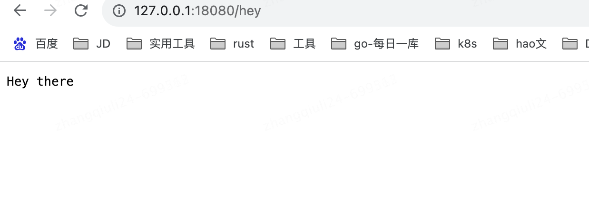
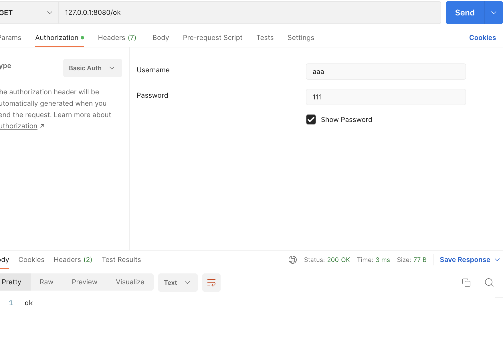
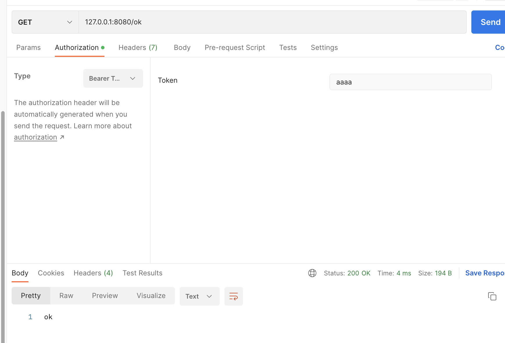
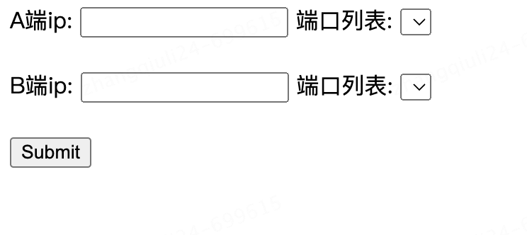

一、基本使用

actix-web使用一个HttpServer+多个App来完成功能，而且是一个线程一个App，也就是**一个后端服务可能存在多个App实例**。同时因为路由之后的处理都是在App里进行的，所以不同的App之间的同名handler可能是不相通的，这就涉及到数据共享(其实就是多线程数据共享问题)。但是这里需要注意，不同的App实例都是同样的结构(clone过来的)。

## 1.1 添加依赖

```
cargo add actix-web

或者
cargo.toml

actix-web = "4.0.0"
actix-cors = "0.6.0" //跨域支持等
```


## 1.2 快速开始

```
#[actix_web::main]
async fn main() {
    actix_web().await;
}


use actix_web::{get, post, web, App, HttpMessage, HttpServer, Responder, HttpResponse};

// 通过宏标注指出请求路径和方法
#[get("/")]
async fn hello()->impl Responder{
    HttpResponse::Ok().body("Hello world")
}

// 把请求体提取成String
#[post("/")]
async fn echo(req_body:String)->impl Responder{
    HttpResponse::Ok().body(req_body)
}

async fn manual_hello()->impl Responder{
    HttpResponse::Ok().body("Hey there")
}

pub async fn web(){
    HttpServer::new(|| {
        println!("WEB LISTENING TO 18080");
        // 在这里传入定义的服务
        App::new()
            .service(hello)
            .service(echo)
            // 这里注意到，route接收三个参数：路径，请求方法和handler
            .route("/hey", web::get().to(manual_hello))
    })
        .bind(("127.0.0.1", 18080)).unwrap()
        .run()
        .await.unwrap();
}
```

请求




此外，actix-web还支持类似Gin的中间件功能，也支持类似Gin的group，即路由组功能。后端服务是围绕App实例构建的，每一个App可以拥有多个handler，同时同一个App内部的多个handler可以共享同一个作用域，或者说资源组，即Scope。位于同一个资源组的handler拥有一样的请求前缀。

这里说一下route，service，resource，scope，handler的区别：

- handler：route内部处理业务的部分，一般handler和route是一个意思
- route：表示一个包含拦截器(guard)的handler
- resource：route集合，一般用来组织不同请求方法的同一URL路径下的不同route
- scope：resource集合，也可以是route几个，用来组织多个拥有相同URL前缀的resource/route
- service：表示一个完整的服务，可以由上面的三个混搭组成


## 1.3 路由组&多路由组

```

use actix_web::{get, post, web, App, HttpMessage, HttpServer, Responder, HttpResponse};
use actix_cors::Cors;

// 通过宏标注指出请求路径和方法
async fn get1() -> impl Responder {
   HttpResponse::Ok().body("get1")
}

async fn post1() -> impl Responder {
   HttpResponse::Ok().body("post1")
}

async fn get2() -> impl Responder {
   HttpResponse::Ok().body("get2")
}

async fn post2() -> impl Responder {
   HttpResponse::Ok().body("post2")
}

#[get("/ok/oks")]
async fn ok() -> impl Responder {
   HttpResponse::Ok().body("OK")
}

/// 测试连接：
/// get@/t1/a
/// post@/t1/a
/// get@/t1/b
/// post@/t1/b
/// get@/ok
pub async fn web(){
    HttpServer::new(move || {
        let cors = Cors::default()
            .allow_any_origin()
            .allow_any_origin()
            .allow_any_method()
            .allow_any_header()
            .max_age(3600);


        println!("WEB LISTENING TO 18080");
        // 在这里传入定义的服务
        App::new()
            .wrap(cors)
            .service(
                web::scope("/t1")
                    .service(web::resource("/a")
                        .route(web::post().to(post1))
                        .route(web::get().to(get1))

                    )
                    .service(web::resource("/b")
                        .route(web::get().to(get2))
                        .route(web::post().to(post2))
                    )
            )
            .service(ok)
            // 这里注意到，route接收三个参数：路径，请求方法和handler
    })
        .bind(("127.0.0.1", 18080)).unwrap()
        .run()
        .await.unwrap();
}
```


```
curl -X POST 'http://127.0.0.1:18080/t1/a' 
post1%    

$ curl -X GET  'http://127.0.0.1:18080/t1/a'
get1%   

$ curl -X GET  'http://127.0.0.1:18080/ok/oks'
OK%  
```


##  1.4 同一个App内共享状态

应用状态被同一个作用域内的所有路由和资源共享，状态可以通过 `web::Data<T>` 来获取访问，其中 T 是状态的类型，中间件也可以访问状态 State。

同一个scope下的多个route可以共享状态

```

use actix_web::{get, post, web, App, HttpMessage, HttpServer, Responder, HttpResponse};
use actix_cors::Cors;

async fn post2(data : web::Data<AppState>) -> impl Responder {
    let app_name = &data.app_name;
    format!("post2 app_name {}",app_name)
}


#[get("/ok/oks")]
async fn ok(data : web::Data<AppState>) -> String {
    let app_name = &data.app_name;
    format!("ok/oks app_name {}",app_name)
}

// This struct represents state
struct AppState {
    app_name: String,
}


pub async fn web(){
    HttpServer::new(move || {
        let cors = Cors::default()
            .allow_any_origin()
            .allow_any_origin()
            .allow_any_method()
            .allow_any_header()
            .max_age(3600);


        println!("WEB LISTENING TO 18080");
        // 在这里传入定义的服务
        App::new()
            .wrap(cors)
            .app_data(web::Data::new(AppState{
                app_name : String::from("Actix Web")
            }))
            .service(ok)
            .route("/post2",web::post().to(post2))
            // 这里注意到，route接收三个参数：路径，请求方法和handler
    })
        .bind(("127.0.0.1", 18080)).unwrap()
        .run()
        .await.unwrap();
}
```


```
$ curl -X GET  'http://127.0.0.1:18080/ok/oks'
ok/oks app_name Actix Web%   

$ curl -X POST  'http://127.0.0.1:18080/post2'
post2 app_name Actix Web%   
```


## 1.5 App间共享数据

而一个后端服务可能有多个App，纯粹的在scope设置共享数据只能实现App内多个handler共享，想要实现App间共享，需要在App::new之外创建状态变量，然后通过Arc+Mutex等方式实现共享：

```
use actix_web::{web, App, HttpServer};
use std::sync::Mutex;

struct AppStateWithCounter {
    counter: Mutex<i32>, // <- Mutex is necessary to mutate safely across threads
}

async fn index(data: web::Data<AppStateWithCounter>) -> String {
    let mut counter = data.counter.lock().unwrap(); // <- get counter's MutexGuard
    *counter += 1; // <- access counter inside MutexGuard

    format!("Request number: {counter}") // <- response with count
}

#[actix_web::main]
async fn main() -> std::io::Result<()> {
    // Note: web::Data created _outside_ HttpServer::new closure
    let counter = web::Data::new(AppStateWithCounter {
        counter: Mutex::new(0),
    });

    HttpServer::new(move || {
        // move counter into the closure
        App::new()
            .app_data(counter.clone()) // <- register the created data
            .route("/", web::get().to(index))
    })
        .bind(("127.0.0.1", 8080))?
        .run()
        .await
}

```


## 1.6 应用守卫和虚拟主机 guard

它定义了请求需要满足的前置条件，只有满足时，和它绑定的route才会被调用。同时actix-web也支持配置切分，即切分公共配置实现复用：

```
use actix_cors::Cors;
use actix_web::web::{route, service};
use actix_web::{get, guard, post, web, App, HttpMessage, HttpResponse, HttpServer, Responder};

async fn post2(data: web::Data<AppState>) -> impl Responder {
    let app_name = &data.app_name;
    format!("post2 app_name {}", app_name)
}

#[get("/ok")]
async fn ok() -> impl Responder {
    HttpResponse::Ok().body("ok")
}
fn config1(config: &mut web::ServiceConfig) {
    config.service(
        web::resource("/t2")
            .route(web::get().to(|| async { HttpResponse::Ok().body("get2") }))
            // 很明显，这里可以做权限拦截使用，限制请求的方法，或者解析Token等操作
            .route(web::to(|| async { HttpResponse::Ok().body("not allowed") })),
    );
}

fn config2(config: &mut web::ServiceConfig) {
    config.service(
        web::resource("/t3")
            .route(web::post().to(|| async { HttpResponse::Ok().body("get3") }))
            // 其实这里可以看到，如果不指定方法，则匹配所有方法
            .route(web::to(|| async { HttpResponse::Ok().body("not allowed") })),
    );
}

// This struct represents state
struct AppState {
    app_name: String,
}

pub async fn web() {
    HttpServer::new(move || {
        let cors = Cors::default()
            .allow_any_origin()
            .allow_any_origin()
            .allow_any_method()
            .allow_any_header()
            .max_age(3600);

        println!("WEB LISTENING TO 18080");
        // 在这里传入定义的服务
        App::new()
            .wrap(cors)
            .app_data(web::Data::new(AppState {
                app_name: String::from("Actix Web"),
            }))
            .service(
                web::scope("/t1")
                    // 要求请求头必须包含如下
                    //如果不包含是请求不到的404
                    .guard(guard::Header("Token", "code-with-buff"))
                    .route(
                        "",
                        web::get().to(|| async { HttpResponse::Ok().body("ok") }),
                    ),
            )
            .configure(config1)
            // 产生的请求不会影响到后续的操作，即config不会影响后面的请求路径和方法，是独立的
            .route(
                "/a",
                web::get().to(|| async { HttpResponse::Ok().body("ok") }),
            )
            // 这里的url会拼接前面的前导url
            .service(web::scope("/b").configure(config2))
            .service(ok)
    })
    .bind(("127.0.0.1", 18080))
    .unwrap()
    .run()
    .await
    .unwrap();
}

```


```
没有加tokon
curl -v -X GET  'http://127.0.0.1:18080/t1'
Note: Unnecessary use of -X or --request, GET is already inferred.
< HTTP/1.1 404 Not Found

```


## 1.7 配置 configure

配置
为了简洁和可重用，App 和 web::Scope 均提供了 configure 方法，此函数用于配置的部分移动到不同的模块设置库中。例如：资源的某些配置可以移动到其它模块。

```
use actix_web::{web, App, HttpResponse, HttpServer};

// this function could be located in a different module
fn scoped_config(cfg: &mut web::ServiceConfig) {
    cfg.service(
        web::resource("/test")
            .route(web::get().to(|| async { HttpResponse::Ok().body("test") }))
            .route(web::head().to(HttpResponse::MethodNotAllowed)),
    );
}

// this function could be located in a different module
fn config(cfg: &mut web::ServiceConfig) {
    cfg.service(
        web::resource("/app")
            .route(web::get().to(|| async { HttpResponse::Ok().body("app") }))
            .route(web::head().to(HttpResponse::MethodNotAllowed)),
    );
}

#[actix_web::main]
async fn main() -> std::io::Result<()> {
    HttpServer::new(|| {
        App::new()
            .configure(config)
            .service(web::scope("/api").configure(scoped_config))
            .route(
                "/",
                web::get().to(|| async { HttpResponse::Ok().body("/") }),
            )
    })
        .bind(("127.0.0.1", 8080))?
        .run()
        .await
}
```


上述代码效果

```
/         -> "/"
/app      -> "app"
/api/test -> "test"
每个 ServiceConfig 都可以有自己的 data、routes、services。
```


## 1.8 https

Actix Web 支持两种 TLS实现： rustls 和 openssl。

需要倒入openssl

```
[dependencies]
actix-web = {version = "4.4.0", features = ["openssl"]}
openssl = "0.10.57"
```


```
use actix_web::{get, App, HttpRequest, HttpServer, Responder};
use openssl::ssl::{SslAcceptor, SslFiletype, SslMethod};

#[get("/")]
async fn index(_req: HttpRequest) -> impl Responder {
    "Welcome!"
}

#[actix_web::main]
async fn main() -> std::io::Result<()> {
    // load TLS keys
    // to create a self-signed temporary cert for testing:
    // `openssl req -x509 -newkey rsa:4096 -nodes -keyout key.pem -out cert.pem -days 365 -subj '/CN=localhost'`
    let mut builder = SslAcceptor::mozilla_intermediate(SslMethod::tls()).unwrap();
    builder
        .set_private_key_file("key.pem", SslFiletype::PEM)
        .unwrap();
    builder.set_certificate_chain_file("cert.pem").unwrap();

    HttpServer::new(|| App::new().service(index))
        .bind_openssl("127.0.0.1:8080", builder)?
        .run()
        .await
}

```


## 1.9 优雅关闭

默认情况下，actix_web 当收到 `SIGTERM` 信号时，将优雅关机，关机时间超时默认30s，可以通过`HttpServer::shutdown_timeout()` 配置

```
 .shutdown_timeout(time::Duration::from_secs(50).as_secs())//默认收到信号 30s后关闭
    .bind(("127.0.0.1", 18080))
    .unwrap()
    .run()
```

可以使用[`HttpServer::disable_signals()`](https://docs.rs/actix-web/4/actix_web/struct.HttpServer.html#method.disable_signals)方法禁用信号处理。

## 1.10 心跳检测

```
use actix_web::{HttpServer, App, HttpResponse};

async fn health_check() -> HttpResponse {
    HttpResponse::Ok().finish()
}

#[actix_web::main]
async fn main() -> std::io::Result<()> {
    HttpServer::new(|| {
        App::new()
            .route("/health", web::get().to(health_check))
            .route("/", web::get().to(|| HttpResponse::Ok().body("Hello Heartbeat!")))
    })
    .bind("127.0.0.1:8080")?
    .run()
    .await
}
```


## 1.11 控制启动的线程数

`HttpServer`自动启动一定数量的 HTTP *Worker*，默认情况下该数量等于系统中物理 CPU 的数量。可以使用该方法覆盖该数字[`HttpServer::workers()`](https://docs.rs/actix-web/4/actix_web/struct.HttpServer.html#method.workers)。

创建工作人员后，他们每个人都会收到一个单独的*应用程序*实例来处理请求。应用程序状态不在线程之间共享，并且处理程序可以自由地操作其状态副本，而无需考虑并发问题。

应用程序状态不需要是`Send`or `Sync`，但应用程序工厂必须是`Send`+ `Sync`。

我mac是10核，启动时候是这样的

```
WEB LISTENING TO 18080
WEB LISTENING TO 18080
WEB LISTENING TO 18080
WEB LISTENING TO 18080
WEB LISTENING TO 18080
WEB LISTENING TO 18080
WEB LISTENING TO 18080
WEB LISTENING TO 18080
WEB LISTENING TO 18080
WEB LISTENING TO 18080


添加workers后
.shutdown_timeout(time::Duration::from_secs(50).as_secs())//默认收到信号 30s后关闭
         .workers(2)
         .bind(("127.0.0.1", 18080))
         
WEB LISTENING TO 18080
WEB LISTENING TO 18080
```


## 1.12 keep-alive

Actix Web 支持保持连接打开以后等待后续请求。 保持连接是服务器定义的行为，所以要设置服务有三种方法

> *保持活动*连接行为由服务器设置定义。

- `Duration::from_secs(75)`或`KeepAlive::Timeout(75)`：启用 75 秒保持活动定时器。
- `KeepAlive::Os`：使用操作系统保持活动状态。
- `None`或`KeepAlive::Disabled`：禁用保持活动状态。

```rust
use actix_web::{http::KeepAlive, HttpServer};
use std::time::Duration;

#[actix_web::main]
async fn main() -> std::io::Result<()> {
    // Set keep-alive to 75 seconds
    let _one = HttpServer::new(app).keep_alive(Duration::from_secs(75));

    // Use OS's keep-alive (usually quite long)
    let _two = HttpServer::new(app).keep_alive(KeepAlive::Os);

    // Disable keep-alive
    let _three = HttpServer::new(app).keep_alive(None);

    Ok(())
}
```


[如果选择上面的第一个选项，则在响应未明确禁止（例如，将连接类型](https://docs.rs/actix-web/4/actix_web/http/enum.ConnectionType.html)设置为`Close`或 ）的情况下，将为 HTTP/1.1 请求启用保持活动状态`Upgrade`。可以使用[on 方法](https://docs.rs/actix-web/4/actix_web/struct.HttpResponseBuilder.html#method.force_close)[强制关闭连接`force_close()``HttpResponseBuilder`](https://docs.rs/actix-web/4/actix_web/struct.HttpResponseBuilder.html#method.force_close)

> HTTP/1.0 的保持活动状态处于**关闭状态**， HTTP/1.1 和 HTTP/2.0 的保持活动状态处于**打开状态。**

```rust
use actix_web::{http, HttpRequest, HttpResponse};

async fn index(_req: HttpRequest) -> HttpResponse {
    let mut resp = HttpResponse::Ok()
        .force_close() // <- Close connection on HttpResponseBuilder
        .finish();

    // Alternatively close connection on the HttpResponse struct
    resp.head_mut().set_connection_type(http::ConnectionType::Close);

    resp
}
```


## 1.13 参数提取器

Actix Web 提供了一种用于类型安全请求信息访问的工具叫做提取器(例如 实现了 FromRequest)，内置了很多提取器。

提取器可以作为处理程序的函数参数来使用，Actix Web支持每个处理器函数最多12个提取器。参数位置不固定。


- Path：用于读取路径参数，可以匹配动态参数值，也可以通过结构体绑定，或者通过类型不安全的方式进行查询参数获取
- Query：绑定查询参数，需要搭配反序列化使用
- JSON：通过读取JSON的方式把请求体绑定到结构体上，同时可以在resource组里定义json解析的配置
- Forms：通过读取表单的形式把请求体绑定到结构体上，JSON和Forms都要求结构体实现了反序列化特征
- Data：访问App状态的方式
- HttpRequest：原生态访问
- String：把请求体直接转换成String
- Bytes：以字节数组的形式访问请求体
- PayLoad：用来构建其他提取器的低层级表示方式，如果请求体是压缩过的，那么得到的则是自动解压缩的结果，即使是流传输


### 1.3.1 Path

Path 提供了 路径参数(Path Parameters)的方法，路径中可提取的部分称为动态段，使用花括号标记，您可以从路径中反序列化任何可变段。


```
use actix_web::{get, web, App, HttpServer, Result};

#[get("/users/{user_id}/{friend}")] // <- define path parameters
async fn index(path: web::Path<(u32, String)>) -> Result<String> {
    let (user_id, friend) = path.into_inner();
    Ok(format!("Welcome {}, user_id {}!", friend, user_id))
}

#[actix_web::main]
async fn main() -> std::io::Result<()> {
    HttpServer::new(|| App::new().service(index))
        .bind(("127.0.0.1", 8080))?
        .run()
        .await
}

```


```
curl -X GET  'http://127.0.0.1:18080/users/56/zhangsan' 
Welcome zhangsan, user_id 56!% 
```


通过动态段名称和字段名称匹配之外，还可以序列化成对象。例如我们可以 Serde

```
use actix_web::{get, web, Result};
use serde::Deserialize;

#[derive(Deserialize)]
struct Info {
    user_id: u32,
    friend: String,
}

/// extract path info using serde
#[get("/users/{user_id}/{friend}")] // <- define path parameters
async fn index(info: web::Path<Info>) -> Result<String> {
    Ok(format!(
        "Welcome {}, user_id {}!",
        info.friend, info.user_id
    ))
}

#[actix_web::main]
async fn main() -> std::io::Result<()> {
    use actix_web::{App, HttpServer};

    HttpServer::new(|| App::new().service(index))
        .bind(("127.0.0.1", 8080))?
        .run()
        .await
}
```

还有一种非类型安全的的替代方法，我们可以使用 HttpRequest 的 match_info 方法。

```
#[get("/users/{user_id}/{friend}")] // <- define path parameters
async fn index(req: HttpRequest) -> Result<String> {
    let name: String = req.match_info().get("friend").unwrap().parse().unwrap();
    let userid: i32 = req.match_info().query("user_id").parse().unwrap();

    Ok(format!("Welcome {}, user_id {}!", name, userid))
}

#[actix_web::main]
async fn main() -> std::io::Result<()> {
    use actix_web::{App, HttpServer};

    HttpServer::new(|| App::new().service(index))
        .bind(("127.0.0.1", 8080))?
        .run()
        .await
}
```

使用场景：路径参数常用于标识资源或指定资源的唯一标识符，例如获取用户信息、获取特定文章。


### 1.3.2 查询参数(Query Parameters)

查询参数是通过 URL 的查询字符串部分来传递的，以`?`开头多个参数之间用`&`分隔。使用场景参数常用于传递筛选、排序、分页等额外的请求参数，例如搜索用户、排序商品列表等。

```

#[derive(Deserialize)]
struct Info {
    username: String,
    age: usize,
}

#[get("/url")]
async fn url_params(info: web::Query<Info>) -> String {
    format!("Welcome {} , age is {}", info.username, info.age)
}

pub async fn web() {
    HttpServer::new(|| App::new().service(index).service(url_params))
        .bind(("127.0.0.1", 18080))
        .unwrap()
        .run()
        .await
        .unwrap();
}

```


```
$ curl -X GET  'http://127.0.0.1:18080/url?username=zhangsan&age=23'
Welcome zhangsan , age is 23%  
```


### 1.3.3 json参数

使用 `JSON<T>` 允许反序列化一个请求体到结构体，要抽取的T 必须 实现反序列化。

```

/// extract path info from "/users/{user_id}/{friend}" url
/// {user_id} - deserializes to a u32
/// {friend} - deserializes to a String
#[get("/users/{user_id}/{friend}")] // <- define path parameters
async fn index(path: web::Path<(u32, String)>) -> Result<String> {
    let (user_id, friend) = path.into_inner();
    Ok(format!("Welcome {}, user_id {}!", friend, user_id))
}

#[derive(Deserialize)]
struct Info {
    username: String,
    age: usize,
}

#[get("/url")]
async fn url_params(info: web::Query<Info>) -> String {
    format!("Welcome {} , age is {}", info.username, info.age)
}
#[post("/json")]
async fn json(info : web::Json<Info>)->Result<String>{
    Ok(format!("Welcome {}, age is {}",info.username,info.age))
}

pub async fn web() {
    HttpServer::new(|| App::new()
        .service(index)
        .service(url_params)
        .service(json)
    )
        .bind(("127.0.0.1", 18080))
        .unwrap()
        .run()
        .await
        .unwrap();
}

```


```
curl  -X POST  -H 'Content-Type:application/json' 'http://127.0.0.1:18080/json' -d '{"username":"zhangsan","age":23}' 

Welcome zhangsan, age is 23%    
```


一些提取器提供了一种配置提取过程的方法，要配置提取器，将其配置对象传递给资源的 app_data() 方法。在JSON 提取器的情况下，返回JsonConfig，配置JSON有效负载的最大大小以及自定义错误处理函数。

```
use actix_web::{error, web, App, HttpResponse, HttpServer, Responder};
use serde::Deserialize;

#[derive(Deserialize)]
struct Info {
    username: String,
}

/// deserialize `Info` from request's body, max payload size is 4kb
async fn index(info: web::Json<Info>) -> impl Responder {
    format!("Welcome {}!", info.username)
}

#[actix_web::main]
async fn main() -> std::io::Result<()> {
    HttpServer::new(|| {
        let json_config = web::JsonConfig::default()
            .limit(4096)
            .error_handler(|err, _req| {
                // create custom error response
                error::InternalError::from_response(err, HttpResponse::Conflict().finish())
                    .into()
            });

        App::new().service(
            web::resource("/")
                // change json extractor configuration
                .app_data(json_config)
                .route(web::post().to(index)),
        )
    })
    .bind(("127.0.0.1", 8080))?
    .run()
    .await
}

```


### 1.3.4 URL的表单数据

x-www-form-urlencoded

````

#[derive(Deserialize)]
struct Info {
    username: String,
    age: usize,
}

/// extract form data using serde
/// this handler gets called only if the content type is *x-www-form-urlencoded*
/// and the content of the request could be deserialized to a `FormData` struct
#[post("/form")]
async fn json(info : web::Form<Info>)->Result<String>{
    Ok(format!("Welcome {}, age is {}",info.username,info.age))
}

pub async fn web() {
    HttpServer::new(|| App::new()
        .service(json)
    )
        .bind(("127.0.0.1", 18080))
        .unwrap()
        .run()
        .await
        .unwrap();
}

````


```
$ curl --location --request POST 'http://127.0.0.1:18080/form?username=aaaa&age=12' \
--header 'Content-Type: application/x-www-form-urlencoded' \
--data-urlencode 'username=aaa' \
--data-urlencode 'age=23'  
Welcome aaa, age is 23%  
```


### 1.3.5 String

```

#[post("/form")]
async fn json(info : String)->Result<String>{
    Ok(format!("Welcome {}",info))
}

pub async fn web() {
    HttpServer::new(|| App::new()
        .service(json)
    )
        .bind(("127.0.0.1", 18080))
        .unwrap()
        .run()
        .await
        .unwrap();
}

```


```
$ curl --location --request POST 'http://127.0.0.1:18080/form?username=aaaa&age=12' \
--header 'Content-Type: text/plain' \
--data-raw 'zhangsan'
Welcome zhangsan%  
```


### 1.3.6 byte

```

#[post("/form")]
async fn json(info : Bytes)->Result<String>{
    Ok(format!("Welcome {:?}",info))
}

pub async fn web() {
    HttpServer::new(|| App::new()
        .service(json)
    )
        .bind(("127.0.0.1", 18080))
        .unwrap()
        .run()
        .await
        .unwrap();
}

```


```
$ curl --location --request POST 'http://127.0.0.1:18080/form?username=aaaa&age=12' \
--header 'Content-Type: text/plain' \
--data-raw 'zhangsan'
Welcome b"zhangsan"%                                                                                                                      

```


### 1.3.7 Payload

```

#[post("/form")]
async fn json(mut body : web::Payload)->Result<String>{
    let mut bytes = web::BytesMut::new();
    while let Some(item) = body.next().await {
        bytes.extend_from_slice(&item?);
    }
    Ok(format!("Request Body Bytes:\n{:?}", bytes))
}

pub async fn web() {
    HttpServer::new(|| App::new()
        .service(json)
    )
        .bind(("127.0.0.1", 18080))
        .unwrap()
        .run()
        .await
        .unwrap();
}

```


```
$ curl --location --request POST 'http://127.0.0.1:18080/form?username=aaaa&age=12' \
--header 'Content-Type: text/plain' \
--data-raw 'zhangsan'
Request Body Bytes:
b"zhangsan"%     
```


### 1.3.8 应用状态提取 Data

应用状态可以通过 web:Data 提取器从处理程序中访问，但是，state 可以作为只读引用访问，如果需要对状态进行可变访问，则必须实现它。

```
use actix_web::{web, App, HttpServer, Responder};
use std::cell::Cell;

#[derive(Clone)]
struct AppState {
    count: Cell<usize>,
}

async fn show_count(data: web::Data<AppState>) -> impl Responder {
    format!("count: {}", data.count.get())
}

async fn add_one(data: web::Data<AppState>) -> impl Responder {
    let count = data.count.get();
    data.count.set(count + 1);

    format!("count: {}", data.count.get())
}

#[actix_web::main]
async fn main() -> std::io::Result<()> {
    let data = AppState {
        count: Cell::new(0),
    };

    HttpServer::new(move || {
        App::new()
            .app_data(web::Data::new(data.clone()))
            .route("/", web::to(show_count))
            .route("/add", web::to(add_one))
    })
    .bind(("127.0.0.1", 8080))?
    .run()
    .await
}

```


如果要跨线程计算，我们需要使用共享的Arc和原子。

```
use actix_web::{get, web, App, HttpServer, Responder};
use std::{
    cell::Cell,
    sync::atomic::{AtomicUsize, Ordering},
    sync::Arc,
};

#[derive(Clone)]
struct AppState {
    local_count: Cell<usize>,
    global_count: Arc<AtomicUsize>,
}

#[get("/")]
async fn show_count(data: web::Data<AppState>) -> impl Responder {
    format!(
        "global_count: {}\nlocal_count: {}",
        data.global_count.load(Ordering::Relaxed),
        data.local_count.get()
    )
}

#[get("/add")]
async fn add_one(data: web::Data<AppState>) -> impl Responder {
    data.global_count.fetch_add(1, Ordering::Relaxed);

    let local_count = data.local_count.get();
    data.local_count.set(local_count + 1);
    
    format!(
        "global_count: {}\nlocal_count: {}",
        data.global_count.load(Ordering::Relaxed),
        data.local_count.get()
    )

}

#[actix_web::main]
async fn main() -> std::io::Result<()> {
    let data = AppState {
        local_count: Cell::new(0),
        global_count: Arc::new(AtomicUsize::new(0)),
    };

    HttpServer::new(move || {
        App::new()
            .app_data(web::Data::new(data.clone()))
            .service(show_count)
            .service(add_one)
    })
    .bind(("127.0.0.1", 8080))?
    .run()
    .await

}
```


### 1.3.9 处理器 HttpRequest

请求处理程序是一个异步函数，它可以接受从请求(实现了 FromRequest)中提取零个或多个参数，并返回一个可以转换为 HttpResponse 的类型。

请求处理分两个阶段进行

1、处理程序对象，返回实现了 Responder 特征的任何对象；
2、在返回对象上调用 response_to 将自身转换为 HttpResponse 或 Error；
默认情况下，Actix Web 提供了一些标准类型的响应器实现，例如 &'static str、String 等

```
async fn index_01(_req: HttpRequest) -> &'static str {
    "Hello world!"
}
async fn index_02(_req: HttpRequest) -> String {
    "Hello world!".to_owned()
}
```


您也可以方法签名，返回 impl Responder

```
async fn index_03(_req: HttpRequest) -> impl Responder {
    web::Bytes::from_static(b"Hello world!")
}
async fn index_04(req: HttpRequest) -> Box<Future<Item=HttpResponse, Error=Error>> {
    ...
}
```


## 1.14 自定义响应体

要从处理器函数直接返回自定义类型，该类型需要实现 Responder trait。

```

#[derive(Serialize)]
struct Res{
    name : &'static str,
    address : String,
    age :u8
}

impl Responder for Res{
    type Body = BoxBody;
    fn respond_to(self, req: &HttpRequest) -> HttpResponse<Self::Body> {
       let body  = serde_json::to_string(&self).unwrap();
        HttpResponse::Ok()
            .content_type(ContentType::json())
            .body(body)
    }
}


#[post("/form")]
async fn json(mut body : web::Payload)->impl Responder{
    Res{
        name : "ZHangQL",
        address : String::from("beijing"),
        age:18
    }
}

pub async fn web() {
    HttpServer::new(|| App::new()
        .service(json)
    )
        .bind(("127.0.0.1", 18080))
        .unwrap()
        .run()
        .await
        .unwrap();
}
```


```
$ curl --location --request POST 'http://127.0.0.1:18080/form?username=aaaa&age=12' \
--header 'Content-Type: text/plain' \
--data-raw 'zhangsan'
{"name":"ZHangQL","address":"beijing","age":18}%   
```


## 1.15 流响应

响应体可以异步生成，在这种情况下，响应体必须实现 `Stream<Item=Result<Bytes,Error>>`

```

#[post("/stream")]
async fn json()->HttpResponse{
   let body = stream::once(ok::<_,Error>(web::Bytes::from_static(b"test")));
    HttpResponse::Ok()
        .content_type("application/json")
        .streaming(body)
}

pub async fn web() {
    HttpServer::new(|| App::new()
        .service(json)
    )
        .bind(("127.0.0.1", 18080))
        .unwrap()
        .run()
        .await
        .unwrap();
}

```

这段代码使用了 `stream::once` 函数创建了一个只包含单个元素的流。这个元素是通过 `web::Bytes::from_static` 函数创建的，它将一个静态字节数组转换为 `web::Bytes` 对象。

具体来说，这段代码的作用是创建一个流（stream），其中包含一个元素，该元素是一个包含字符串 `"test"` 的字节数组。这个流可以用于处理异步操作，例如在网络编程中发送响应体。

这里使用了 `once` 函数，它是 `futures` 库中的一个函数，用于创建一个只包含单个元素的流。这个函数接受一个 `Result` 类型的参数，并返回一个实现了 `Stream` trait 的对象。在这个例子中，我们使用了 `ok` 函数来创建一个成功的 `Result`，并将其包装在 `once` 函数中。

```
$ curl --location --request POST 'http://127.0.0.1:18080/stream'  
test% 
```


## 1.16 不同的返回类型(Either)

有些时候，你需要返回不同类型的响应，例如错误校验返回错误，成功就返回 Response，或别的响应结果。在这种情况下，可以使用 Either 类型。

```
use actix_web::{Either, Error, HttpResponse};

type RegisterResult = Either<HttpResponse, Result<&'static str, Error>>;

async fn index() -> RegisterResult {
    if is_a_variant() {
        // choose Left variant
        Either::Left(HttpResponse::BadRequest().body("Bad data"))
    } else {
        // choose Right variant
        Either::Right(Ok("Hello!"))
    }
}
```


## 2 错误处理

Actix Web 使用自己的 actix_web::error::Error 类型 和actix_web::error::ResponseError 特征来进行错误处理。如果一个处理器返回了一个 Error，同样实现了 ResponseError 的Reulst，Actix Web 会把该错误呈现为带有 actix_web:: HTTP::StatusCode 的HTTP响应
```
pub trait ResponseError {
    fn error_response(&self) -> Response<Body>;
    fn status_code(&self) -> StatusCode;
}
```

### 2.1 自定义错误

```
use actix_web::{error, Result};
use derive_more::{Display, Error};

//////////////////////////////////////////// 自定义错误
#[derive(Debug,Display,derive_more::Error)]
#[display(fmt="my error : {}",name)]
struct MyErr{
    name : &'static str
}

impl error::ResponseError for MyErr{}

#[post("/err")]
async  fn err()-> Result<&'static str ,MyErr>{
    let err = MyErr{name:"test err"};
    println!("self.code {}",err.status_code());
    println!("self.error {:?}",err.error_response());
    Err(err)
}

pub async fn web() {
    HttpServer::new(|| App::new()
        .service(err)
    )
        .bind(("127.0.0.1", 18080))
        .unwrap()
        .run()
        .await
        .unwrap();
}

```

`derive_more` 是一个 Rust 库，它提供了一些有用的宏，用于为自定义数据类型自动生成一些常见的 trait 实现。这些宏可以简化代码编写，减少样板代码的数量。

要使用 `derive_more`，需要在项目的 `Cargo.toml` 文件中添加相应的依赖。例如，要使用 `derive_more` 的 `Add` 宏，可以添加以下依赖：

```toml
[dependencies]
derive_more = "0.99"
```

下面是一些 `derive_more` 提供的常用宏的示例：

- `Add`: 为类型生成 `std::ops::Add` trait 的实现，用于支持加法操作符 (`+`)。
- `Sub`: 为类型生成 `std::ops::Sub` trait 的实现，用于支持减法操作符 (`-`)。
- `Mul`: 为类型生成 `std::ops::Mul` trait 的实现，用于支持乘法操作符 (`*`)。
- `Div`: 为类型生成 `std::ops::Div` trait 的实现，用于支持除法操作符 (`/`)。
- `Rem`: 为类型生成 `std::ops::Rem` trait 的实现，用于支持取余操作符 (`%`)。
- `BitAnd`: 为类型生成 `std::ops::BitAnd` trait 的实现，用于支持按位与操作符 (`&`)。
- `BitOr`: 为类型生成 `std::ops::BitOr` trait 的实现，用于支持按位或操作符 (`|`)。
- `BitXor`: 为类型生成 `std::ops::BitXor` trait 的实现，用于支持按位异或操作符 (`^`)。
- `Not`: 为类型生成 `std::ops::Not` trait 的实现，用于支持按位取反操作符 (`!`)。
- `Neg`: 为类型生成 `std::ops::Neg` trait 的实现，用于支持取负操作符 (`-`)。

```
$ curl --location --request POST 'http://127.0.0.1:18080/err'
my error : test err%
```


**ResponseError 有默认的 error_response 实现，它讲渲染为500 错误， 这是上述 index 处理器将会发生的。我们也可以覆盖 error_response 方法。**

```
pub trait ResponseError: fmt::Debug + fmt::Display {
    /// Returns appropriate status code for error.
    ///
    /// A 500 Internal Server Error is used by default. If [error_response](Self::error_response) is
    /// also implemented and does not call `self.status_code()`, then this will not be used.
    fn status_code(&self) -> StatusCode {
        StatusCode::INTERNAL_SERVER_ERROR
    }

    /// Creates full response for error.
    ///
    /// By default, the generated response uses a 500 Internal Server Error status code, a
    /// `Content-Type` of `text/plain`, and the body is set to `Self`'s `Display` impl.
    fn error_response(&self) -> HttpResponse<BoxBody> {
        let mut res = HttpResponse::new(self.status_code());

        let mut buf = BytesMut::new();
        let _ = write!(helpers::MutWriter(&mut buf), "{}", self);

        let mime = mime::TEXT_PLAIN_UTF_8.try_into_value().unwrap();
        res.headers_mut().insert(header::CONTENT_TYPE, mime);

        res.set_body(BoxBody::new(buf))
    }

    downcast_get_type_id!();
}
```


```
self.code 500 Internal Server Error
self.error HttpResponse { error: None, res: 
Response HTTP/1.1 500 Internal Server Error
  headers:
    "content-type": "text/plain; charset=utf-8"
  body: Sized(19)
 }
```


### 2.2 覆盖error_response


```
use actix_web::{
    error, get,
    http::{header::ContentType, StatusCode},
    App, HttpResponse,
};
use derive_more::{Display, Error};

#[derive(Debug,Display,derive_more::Error)]
enum MyErr{
    #[display(fmt = "internal error")]
    InternalError,

    #[display(fmt="bad request")]
    BadClientData,

    #[display(fmt = " timeout")]
    Timeout
}


impl error::ResponseError for MyErr{
    fn status_code(&self) -> StatusCode {
        match *self {
            MyErr::InternalError => StatusCode::INTERNAL_SERVER_ERROR,
            MyErr::BadClientData => StatusCode::BAD_REQUEST,
            MyErr::Timeout => StatusCode::GATEWAY_TIMEOUT
        }
    }

    fn error_response(&self) -> HttpResponse<BoxBody> {
        HttpResponse::build(self.status_code())
            .insert_header(ContentType::html())
            .body(self.to_string())
    }
}

#[post("/err")]
async  fn err()-> Result<&'static str ,MyErr>{
    Err(MyErr::BadClientData)
}

pub async fn web() {
    HttpServer::new(|| App::new()
        .service(err)
    )
        .bind(("127.0.0.1", 18080))
        .unwrap()
        .run()
        .await
        .unwrap();
}

```


```
$ curl --location --request POST 'http://127.0.0.1:18080/err'
bad request%  
```


### 2.3 错误辅助

Actix Web 提供了一组错误辅助函数，用于从其他错误生成特定的HTTP 错误代码。这里我们使用 map_err 将 MyError 转换为 400(错误请求)。

```
use actix_web::{error, get, App, HttpServer};

#[derive(Debug)]
struct MyErrors {
    name: &'static str,
}
#[post("/err")]
async  fn err()-> Result<String>{
    let result = Err(MyErrors{name : "error test"});
    result.map_err(|errs| error::ErrorBadRequest(errs.name))
}

pub async fn web() {
    HttpServer::new(|| App::new()
        .service(err)
    )
        .bind(("127.0.0.1", 18080))
        .unwrap()
        .run()
        .await
        .unwrap();
}

```

```
$ curl --location --request POST 'http://127.0.0.1:18080/err'
error test% 
```


### 2.4 错误日志

Actix 日志所有错误都在 WARN 日志级别。如果应用日志级别设置为 DEBUG，并且开启 RUST_BACKTRACE，错误的堆栈信息都会记录。

```
RUST_BACKTRACE=1 RUST_LOG=actix_web=debug cargo run
```


### 2.5 推荐错误处理方式

考虑将应用程序产生的错误分为两大类：面向用户的错误和非面向用户的错误。

```
use actix_web::{
    error, get,
    http::{header::ContentType, StatusCode},
    App, HttpResponse, HttpServer,
};
use derive_more::{Display, Error};

#[derive(Debug, Display, Error)]
enum UserError {
    #[display(fmt = "Validation error on field: {}", field)]
    ValidationError { field: String },
}

impl error::ResponseError for UserError {
    fn error_response(&self) -> HttpResponse {
        HttpResponse::build(self.status_code())
            .insert_header(ContentType::html())
            .body(self.to_string())
    }
    fn status_code(&self) -> StatusCode {
        match *self {
            UserError::ValidationError { .. } => StatusCode::BAD_REQUEST,
        }
    }
}

```

并不是所有的错误都需要返回错误信息，例如服务器发生了故障，我们需要对用户隐藏细节，例如数据库宕机等等。

```
use actix_web::{
    error, get,
    http::{header::ContentType, StatusCode},
    App, HttpResponse, HttpServer,
};
use derive_more::{Display, Error};

#[derive(Debug, Display, Error)]
enum UserError {
    #[display(fmt = "An internal error occurred. Please try again later.")]
    InternalError,
}

impl error::ResponseError for UserError {
    fn error_response(&self) -> HttpResponse {
        HttpResponse::build(self.status_code())
            .insert_header(ContentType::html())
            .body(self.to_string())
    }

    fn status_code(&self) -> StatusCode {
        match *self {
            UserError::InternalError => StatusCode::INTERNAL_SERVER_ERROR,
        }
    }
}

#[get("/")]
async fn index() -> Result<&'static str, UserError> {
    do_thing_that_fails().map_err(|_e| UserError::InternalError)?;
    Ok("success!")
}

```


## 3 日志记录

### 3.1 使用

我们可以使用 middleware::Loagger 默认依赖env_logger 和 log ，来记录日志。

```

#[derive(Debug)]
struct MyErrors {
    name: &'static str,
}
#[post("/err")]
async fn err() -> Result<String> {
    let result = Err(MyErrors { name: "error test" });
    result.map_err(|errs| error::ErrorBadRequest(errs.name))
}

pub async fn web() {
    std::env::set_var("RUST_LOG", "info");
    std::env::set_var("RUST_BACKTRACE", "1");
    env_logger::init();
    HttpServer::new(|| {
        let logger = Logger::default();
        App::new().wrap(logger).service(err)
    })
    .bind(("127.0.0.1", 18080))
    .unwrap()
    .run()
    .await
    .unwrap();
}

```


```
$ curl --location --request POST 'http://127.0.0.1:18080/err'
error test%  
$ curl --location --request POST 'http://127.0.0.1:18080/err?name=nn'
error test%  

[2023-11-10T03:38:51Z INFO  actix_server::builder] starting 10 workers
[2023-11-10T03:38:51Z INFO  actix_server::server] Actix runtime found; starting in Actix runtime
[2023-11-10T03:40:43Z INFO  actix_web::middleware::logger] 127.0.0.1 "POST /err HTTP/1.1" 400 10 "-" "curl/7.79.1" 0.000152
[2023-11-10T03:41:10Z INFO  actix_web::middleware::logger] 127.0.0.1 "POST /err?name=nn HTTP/1.1" 400 10 "-" "curl/7.79.1" 0.000090
```

### 3.2 actin_web Logger

使用`Logger`指定的`format`. `Logger`可以使用方法创建默认值`default`，它使用默认格式：

```ignore
  %a %t "%r" %s %b "%{Referer}i" "%{User-Agent}i" %T
```


```rust
use actix_web::middleware::Logger;
use env_logger::Env;

#[actix_web::main]
async fn main() -> std::io::Result<()> {
    use actix_web::{App, HttpServer};

    env_logger::init_from_env(Env::default().default_filter_or("info"));

    HttpServer::new(|| {
        App::new()
            .wrap(Logger::default())
            .wrap(Logger::new("%a %{User-Agent}i"))
    })
    .bind(("127.0.0.1", 8080))?
    .run()
    .await
}
```


以下是默认日志记录格式的示例：

```rust
INFO:actix_web::middleware::logger: 127.0.0.1:59934 [02/Dec/2017:00:21:43 -0800] "GET / HTTP/1.1" 302 0 "-" "curl/7.54.0" 0.000397
INFO:actix_web::middleware::logger: 127.0.0.1:59947 [02/Dec/2017:00:22:40 -0800] "GET /index.html.html HTTP/1.1" 200 0 "-" "Mozilla/5.0 (Macintosh; Intel Mac OS X 10.13; rv:57.0) Gecko/20100101 Firefox/57.0" 0.000646
```

[格式](https://actix.rs/docs/middleware/#format)

- `%%`百分号
- `%a`远程 IP 地址（如果使用反向代理，则为代理的 IP 地址）
- `%t`开始处理请求的时间
- `%P`为请求提供服务的子进程 ID
- `%r`请求的第一行
- `%s`响应状态码
- `%b`响应大小（以字节为单位），包括 HTTP 标头
- `%T`处理请求所花费的时间（以秒为单位，采用 .06f 格式的浮动分数）
- `%D`处理请求所花费的时间（以毫秒为单位）
- `%{FOO}i`request.headers['FOO']
- `%{FOO}o`响应.headers['FOO']
- `%{FOO}e`os.environ['FOO']

### 3.3 env_log 记录到文件

后面我们详细介绍下env_log

```

#[derive(Debug)]
struct MyErrors {
    name: &'static str,
}
#[post("/err")]
async fn err() -> Result<String> {
    let result = Err(MyErrors { name: "error test" });
    result.map_err(|errs| error::ErrorBadRequest(errs.name))
}

pub async fn web() {
    // 配置 env_logger，将日志输出到文件
    env_logger::Builder::from_env(Env::default().default_filter_or("info"))
        .format_timestamp(None)
        .format_module_path(false)
        .init();
    HttpServer::new(|| {
        let logger = Logger::default();
        App::new().wrap(logger).service(err)
    })
    .bind(("127.0.0.1", 18080))
    .unwrap()
    .run()
    .await
    .unwrap();
}
```


启动

```
cargo run 2>app.log
```


```
$ curl --location --request POST 'http://127.0.0.1:18080/err?name=nn'
error test%   

$ cat app.log                                                        
   Compiling my_test v0.1.0 (/Users/zhangqiuli24/Desktop/rust/my_test)
    Finished dev [unoptimized + debuginfo] target(s) in 9.63s
     Running `target/debug/my_test`
[INFO  actix_server::builder] starting 10 workers
[INFO  actix_server::server] Actix runtime found; starting in Actix runtime
[INFO  actix_web::middleware::logger] 127.0.0.1 "POST /err?name=nn HTTP/1.1" 400 10 "-" "curl/7.79.1" 0.000109


```


## 4 URL分发

URL分发提供了一个使用简单模式匹配语言将URL映射到处理程序代码的简单方法。如果其中一个个模式匹配与请求关联的路径信息，则调用特定的处理程序对象。

请求处理程序是一个函数，接收一个可以从 FromRequest 中提取零个或多个参数，并返回一个可以转换为 HttpResponse 的类型。


### 4.1 添加路由

其实怎么添加路由在前面已经介绍过了，下面我们来看个例子

```
use actix_web::{web, App, HttpResponse, HttpServer};

async fn index() -> HttpResponse {
    HttpResponse::Ok().body("Hello")
}

#[actix_web::main]
async fn main() -> std::io::Result<()> {
    HttpServer::new(|| {
        App::new()
            .route("/", web::get().to(index))
            .route("/user", web::post().to(index))
    })
    .bind(("127.0.0.1", 8080))?
    .run()
    .await
}

```

虽然 App::route 提供了注册路由的简单方法，但要访问完整的资源配置，必须使用另一种方法。service() 方法将单个资源添加到应用程序路由表中。

如果资源没有包含任何路由或匹配路由，它将返回 NOT FOUND HTTP响应。

### 4.2 路由守卫 route guard

资源包含一组路由，每个路由一次有一组守卫和一个处理程序。可以使用 Resource::route 方法创建新路由，该方法返回一个路由实例的引用。默认情况下，路由不包含任何守卫你，因此匹配所有请求，默认处理程序是
HttpNotFound。

应用程序根据在资源注册和路由注册期间定义的路由标准路由传入请求。 Resource 按照通过 Resource:: route 注册的路由顺序匹配所包含的所有的路由。

例子：一个路由可以包含任意数量的守卫，但是只能包含一个处理程序。
```
App::new().service(
    web::resource("/path").route(
        web::route()
            .guard(guard::Get())
            .guard(guard::Header("content-type", "text/plain"))
            .to(HttpResponse::Ok),
    ),
)
```

在上述例子中，如果请求包含 content-type 报头，且报头的值为 text/plain ，并且 path 等于 /path，则返回HttpResponse::Ok

如果资源不能匹配任何路由，则返回 NOT FOUND 响应。 ResourceHandler::route 返回一个 route 对象。路由可以用类似于构建器的模式来配置。

Route::guard()注册一个新的保护。每条路线可以注册任意数量的警卫。
Route::method()注册一个方法保护。每条路线可以注册任意数量的警卫。
Route::to()为该路由注册了一个异步处理函数。只能注册一个处理程序。通常，处理程序注册是最后一个配置操作。


### 4.3 路由匹配

Actix Web在模式参数重使用的模式匹配语言的语法很简单。路由配置中使用的模式可以以斜杆字符开头，如果模式不以斜杆字符开头，则匹配时，**将在其前面加上隐式斜杆。**

```
{foo}/bar/baz
/{foo}/bar/baz
```

上述两种写法是等价的

变量部分以标识符的形式制定，这意味着接受除下一个斜杆字符以外的任何字符，并且将其作用 HttpRequest.match_info 对象中的名称。

模式中的替换标记匹配正则表达式 :`[^{}/]+`


match_info 是 Params 对象，表示基于路由模式从 URL中提取的动态部分，它可以通过 request.match_info 获取，例如下面模式定义了一个文字段和两个替换标志。

```
foo/{baz}/{bar}
```

上述模式匹配的URL将生成一下信息

```
foo/1/2        -> Params {'baz': '1', 'bar': '2'}
foo/abc/def    -> Params {'baz': 'abc', 'bar': 'def'}
```

下面URL将不匹配

```
foo/1/2/        -> No match (trailing slash)
bar/abc/def     -> First segment literal mismatch
```

段中的段替换标记的匹配将只在模式中的段中的第一个非字母、数字、字符之前完成。因此，例如，如果使用了一下路由模式


### 4.4 路由范围

路由范围可以帮助我们组织公共根路径的路由，可以在作用域内嵌套作用域。例如下面的Path

```
/usrs
/users/show
/users/show/{id}
```


我们可以使用下面的写法来组织路由

```
#[get("/show")]
async fn show_users() -> HttpResponse {
    HttpResponse::Ok().body("Show users")
}

#[get("/show/{id}")]
async fn user_detail(path: web::Path<(u32,)>) -> HttpResponse {
    HttpResponse::Ok().body(format!("User detail: {}", path.into_inner().0))
}

#[actix_web::main]
async fn main() -> std::io::Result<()> {
    HttpServer::new(|| {
        App::new().service(
            web::scope("/users")
                .service(show_users)
                .service(user_detail),
        )
    })
    .bind(("127.0.0.1", 8080))?
    .run()
    .await
}
```


scope的路径可以包含可变路径段作为你资源与未使用作用域路径一致。可以从 HttpRequest:: match_info 中获取可变路径。路径提取器也能够提取范围级变量段。


### 4.5 生成资源URL

使用 HttpRequest.url_for 方法根据资源模式生成URL，HttpRequest.url_for 只能被命名资源调用，否则将会返回错误。

```
use actix_web::{get, guard, http::header, HttpRequest, HttpResponse, Result};

#[get("/test/")]
async fn index(req: HttpRequest) -> Result<HttpResponse> {
    let url = req.url_for("foo", ["1", "2", "3"])?; // <- generate url for "foo" resource

    Ok(HttpResponse::Found()
        .insert_header((header::LOCATION, url.as_str()))
        .finish())
}

#[actix_web::main]
async fn main() -> std::io::Result<()> {
    use actix_web::{web, App, HttpServer};

    HttpServer::new(|| {
        App::new()
            .service(
                web::resource("/test/{a}/{b}/{c}")
                    .name("foo") // <- set resource name, then it could be used in `url_for`
                    .guard(guard::Get())
                    .to(HttpResponse::Ok),
            )
            .service(index)
    })
    .bind(("127.0.0.1", 8080))?
    .run()
    .await
}
```

```
上述代码，我们将会将 http://localhost:8080/test/ 地址重定向http://localhost:8080/test/1/2/3地址。
```


### 4.6 外部资源

有效的URL资源可以注册为外部资源，它们仅对URL生成有用，在请求时从不考虑进行匹配。

```

#[post("/err")]
async fn err(req: HttpRequest) -> impl Responder {
    let url = req.url_for("baidu", ["test"]).unwrap();
    url.to_string()
}

pub async fn web() {
    // 配置 env_logger，将日志输出到文件
    env_logger::Builder::from_env(Env::default().default_filter_or("info"))
        .format_timestamp(None)
        .format_module_path(false)
        .init();
    HttpServer::new(|| {
        let logger = Logger::default();
        App::new().wrap(logger).
            service(err)
            .external_resource("baidu", "https://www.baidu.com/s?wd={wd}")
    })
    .bind(("127.0.0.1", 18080))
    .unwrap()
    .run()
    .await
    .unwrap();
}
```


```
$ curl --location --request POST 'http://127.0.0.1:18080/err?name=nn'
https://www.baidu.com/s%3Fwd=test%   
```


### 4.7 route group

web::scope 方法允许设置一个特定的应用范围，这个作用域表示一个资源前缀，它将宝贝附加到资源配置添加到所有资源模式上，可以用来帮助在不同位置上挂载一组路由，而不是包含的可调用对象的作者想要的位置，同时仍然保持相同的资源名称。

```
#[get("/show")]
async fn show_users() -> HttpResponse {
    HttpResponse::Ok().body("Show users")
}

#[get("/show/{id}")]
async fn user_detail(path: web::Path<(u32,)>) -> HttpResponse {
    HttpResponse::Ok().body(format!("User detail: {}", path.into_inner().0))
}

#[actix_web::main]
async fn main() -> std::io::Result<()> {
    HttpServer::new(|| {
        App::new().service(
            web::scope("/users")
                .service(show_users)
                .service(user_detail),
        )
    })
    .bind(("127.0.0.1", 8080))?
    .run()
    .await
}
```

在上面的例子中，show_users 路由将一个有效的路由模式 /users/show，而不是 show，因此应用程序的作用域将被添加到模式中，只有当URL路径为 /users/show 时，路由才会匹配，当 HttpRequest.url_for 以路由名称为 show_users 调用时，它将生成一个具有相同路径的URL。

### 4.8 自定义路由守卫

路由守卫可以看作是一个简单的函数，它接受请求对象引用并返回true或false，形式上，guard 是任何实现 guard 特性的对象。

```

struct ContentTypeHeader;

impl Guard for ContentTypeHeader {
    fn check(&self, req: &GuardContext) -> bool {
        req.head()
            .headers()
            .contains_key(http::header::CONTENT_TYPE)
    }
}

pub async fn web() {
    // 配置 env_logger，将日志输出到文件
    env_logger::Builder::from_env(Env::default().default_filter_or("info"))
        .format_timestamp(None)
        .format_module_path(false)
        .init();
    HttpServer::new(|| {
        let logger = Logger::default();
        App::new().wrap(logger)
            .route("/",
                   web::route()
                       .guard(ContentTypeHeader)
                       .to(HttpResponse::Ok)
            )

    })
    .bind(("127.0.0.1", 18080))
    .unwrap()
    .run()
    .await
    .unwrap();
}

```


校验是否包含content-Type

```
$ curl -v  --location --request POST 'http://127.0.0.1:18080/' --header 'Content-Type: text/plain'
*   Trying 127.0.0.1:18080...
* Connected to 127.0.0.1 (127.0.0.1) port 18080 (#0)
> POST / HTTP/1.1
> Host: 127.0.0.1:18080
> User-Agent: curl/7.79.1
> Accept: */*
> Content-Type: text/plain
> 
* Mark bundle as not supporting multiuse
< HTTP/1.1 200 OK
< content-length: 0
< date: Fri, 10 Nov 2023 07:30:28 GMT
< 
* Connection #0 to host 127.0.0.1 left intact


$ curl -v  --location --request POST 'http://127.0.0.1:18080/'                                    
*   Trying 127.0.0.1:18080...
* Connected to 127.0.0.1 (127.0.0.1) port 18080 (#0)
> POST / HTTP/1.1
> Host: 127.0.0.1:18080
> User-Agent: curl/7.79.1
> Accept: */*
> 
* Mark bundle as not supporting multiuse
< HTTP/1.1 404 Not Found
< content-length: 0
< date: Fri, 10 Nov 2023 07:30:35 GMT
< 
* Connection #0 to host 127.0.0.1 left intact
```


### 4.9 guard 方法守护

您可以通过将任何谓词值包装在谓词中来反转其含义`Not`。例如，如果您想为除“GET”之外的所有方法返回“METHOD NOT ALLOWED”响应：

```
use actix_web::{guard, web, App, HttpResponse, HttpServer};

async fn err(req: HttpRequest) -> Result<String> {
    Ok(String::from("OK"))
}

pub async fn web() {
    // 配置 env_logger，将日志输出到文件
    env_logger::Builder::from_env(Env::default().default_filter_or("info"))
        .format_timestamp(None)
        .format_module_path(false)
        .init();
    HttpServer::new(|| {
        let logger = Logger::default();
        App::new().wrap(logger)
            .route("/err",
                   web::route()
                       .guard(guard::Not(guard::Get()))
                       .to(err)
            )

    })
    .bind(("127.0.0.1", 18080))
    .unwrap()
    .run()
    .await
    .unwrap();
}
```

上面`guard(guard::Not(guard::Get()))`限制了不能是get

```
$ curl -v  --location --request GET 'http://127.0.0.1:18080/err'
Note: Unnecessary use of -X or --request, GET is already inferred.
*   Trying 127.0.0.1:18080...
* Connected to 127.0.0.1 (127.0.0.1) port 18080 (#0)
> GET /err HTTP/1.1
> Host: 127.0.0.1:18080
> User-Agent: curl/7.79.1
> Accept: */*
> 
* Mark bundle as not supporting multiuse
< HTTP/1.1 404 Not Found
< content-length: 0
< date: Fri, 10 Nov 2023 07:39:17 GMT
< 
* Connection #0 to host 127.0.0.1 left intact

$ curl   --location --request GET 'http://127.0.0.1:18080/err' 

# zhangqiuli24 @ ZBMAC-8c20c42fd in ~/Desktop/rust/my_test on git:master x [15:39:43] 
$ curl   --location --request POST 'http://127.0.0.1:18080/err'
OK%                                                                                        

```


你可以通过将任何动词值包装在Not中反转含义，例如你想要除了 GET 方法之外的所有方法都返回 METHOD NOT ALLOWED。

例子：

```
use actix_web::{guard, web, App, HttpResponse, HttpServer};

#[actix_web::main]
async fn main() -> std::io::Result<()> {
    HttpServer::new(|| {
        App::new().route(
            "/",
            web::route()
                .guard(guard::Not(guard::Get()))
                .to(HttpResponse::MethodNotAllowed),
        )
    })
    .bind(("127.0.0.1", 8080))?
    .run()
    .await
}
```


我们可以也使用 Any 守卫接受一个列表来匹配任何允许的守卫，也可以使用 ALL 守卫接受任何匹配的值。

该`Any`守卫接受守卫列表，并且如果提供的任何守卫匹配，则匹配。IE：

```rust
guard::Any(guard::Get()).or(guard::Post())
```

该`All`守卫接受守卫列表，并且如果所有提供的守卫都匹配，则匹配。IE：

```rust
guard::All(guard::Get()).and(guard::Header("content-type", "plain/text"))
```


### 4.10 修改默认 NOT Found 响应
如果在路由表中找不到的路径模式，或者某个资源找不到匹配的路由，则使用默认资源，默认响应是 NOT FOUND，可以使用 App::default_service() 覆盖NOT FOUND响应，此方法接受一个与 App::service 相同的方法。

```
#[actix_web::main]
async fn main() -> std::io::Result<()> {
    HttpServer::new(|| {
        App::new()
            .service(web::resource("/").route(web::get().to(index)))
            .default_service(
                web::route()
                    .guard(guard::Not(guard::Get()))
                    .to(HttpResponse::MethodNotAllowed),
            )
    })
    .bind(("127.0.0.1", 8080))?
    .run()
    .await
}
```


## 5 请求

### 5.1 content编码

Content 编码
Actix Web 支持下面几种 payload 编解码。

- Brotli：开源的一种新型的压缩算法，比Gzip压缩性能更好，支持的类型有text/xml、text/plain、text/css、application/javascript、application/x-javascript、application/rss+xml、text/javascript、image/tiff、image/svg+xml、application/json、application/xml
- Gzip：
- Deflate：
- Zstd：

如果你的请求头包含 Content-Encoding 报头信息，则根据报头对请求负载进行解压缩。不支持多个值。

### 5.2 分块传输编码(Chunked transfer encoding)

Actix 会自动解码分块编码，web::Payloa 提取器已经包含了解码的字节流。如果请求负载使用了支持的压缩编解码器之一进行压缩，则字节流将被解压缩。

## 6 文件上传

Actix Web 支持 multipart 流，我们需要引入 actix-multipart crate。

1、添加依赖

```
 cargo add actix-multipart 
```

2、添加代码

```
use actix_multipart::{
    form::{
        tempfile::{TempFile, TempFileConfig},
        MultipartForm,
    },
};
use actix_web::{ web, App, Error, HttpResponse, HttpServer, Responder};

#[derive(Debug,MultipartForm)]
struct UploadForm{
    #[multipart(rename="file")]
    files : Vec<TempFile>
}

async fn save_files(MultipartForm(form): MultipartForm<UploadForm>)->Result<impl Responder,Error>{
    for f in form.files{
        let path = format!("./tmp/{}",f.file_name.unwrap());
        f.file.persist(path).unwrap();
    }
    Ok(HttpResponse::Ok())
}


pub async fn web() {
    std::fs::create_dir_all("./tmp").unwrap();
    println!("starting HTTP server at http:/localhost:9090");

    HttpServer::new(|| {
        App::new()
            .app_data(TempFileConfig::default().directory("./tmp"))
            .service(web::resource("/")
                         .route(web::post().to(save_files))
            )


    })
    .bind(("127.0.0.1", 18080))
    .unwrap()
    .run()
    .await
    .unwrap();
}

```


注意是form-data格式，key 是file

```
$ ll tmp
total 8
-rw-------  1 zhangQL  staff  1670 Nov 10 16:39 aaaaaa.html
```


## 7 JSON 响应

JSON 类型允许使用格式良好的 JSON 数据进行响应，只需要返回 JSON<T> 的值。其中T就是序列为JSON 的结构的类型，类型T必须实习 serde 的 Serialize 特征。

1、添加依赖

```
serde = {version = "1.0.190", features = ["derive"]}
```

```

#[derive(Serialize)]
struct MyObj {
    name: String,
}

#[get("/a/{name}")]
async fn indexs(name : web::Path<String>)->Result<impl Responder>{
    let obj = MyObj{
        name : name.to_string()
    };
    Ok(web::Json(obj))
}

pub async fn web() {

    HttpServer::new(|| {
        App::new()
            .service(indexs)


    })
    .bind(("127.0.0.1", 18080))
    .unwrap()
    .run()
    .await
    .unwrap();
}

```


```
$ curl   --location --request GET  'http://127.0.0.1:18080/a/ZHangQL'
{"name":"ZHangQL"}%  
```


## 8 Content 编码

Actix web 支持自动压缩，我们可以使用 压缩中间件 middleware::Compress。支持下列编码

- Brotli
- Gzip
- Deflate
- Identity

```
use actix_web::{get, middleware, App, HttpResponse, HttpServer};

#[get("/")]
async fn index() -> HttpResponse {
    HttpResponse::Ok().body("data")
}

#[actix_web::main]
async fn main() -> std::io::Result<()> {
    HttpServer::new(|| {
        App::new()
            .wrap(middleware::Compress::default())
            .service(index)
    })
    .bind(("127.0.0.1", 8080))?
    .run()
    .await
}
```


响应头默认是：ContentEncoding::Auto，它是基于请求的Accept-Encoding头执行自动内容压缩协商的。可以通过将 Content-Encoding 设置为 Identity 值。

```
use actix_web::{
    get, http::header::ContentEncoding, middleware, App, HttpResponse, HttpServer,
};

#[get("/")]
async fn index() -> HttpResponse {
    HttpResponse::Ok()
        // v- disable compression
        .insert_header(ContentEncoding::Identity)
        .body("data")
}

#[actix_web::main]
async fn main() -> std::io::Result<()> {
    HttpServer::new(|| {
        App::new()
            .wrap(middleware::Compress::default())
            .service(index)
    })
    .bind(("127.0.0.1", 8080))?
    .run()
    .await
}

```


我们也可以手动设置响应头，来绕过中间件

```
use actix_web::{
    get, http::header::ContentEncoding, middleware, App, HttpResponse, HttpServer,
};

static HELLO_WORLD: &[u8] = &[
    0x1f, 0x8b, 0x08, 0x00, 0xa2, 0x30, 0x10, 0x5c, 0x00, 0x03, 0xcb, 0x48, 0xcd, 0xc9, 0xc9,
    0x57, 0x28, 0xcf, 0x2f, 0xca, 0x49, 0xe1, 0x02, 0x00, 0x2d, 0x3b, 0x08, 0xaf, 0x0c, 0x00,
    0x00, 0x00,
];

#[get("/")]
async fn index() -> HttpResponse {
    HttpResponse::Ok()
        .insert_header(ContentEncoding::Gzip)
        .body(HELLO_WORLD)
}
```


## 9 中间件

中间件介绍
Actix Web 的中间件系统允许我们在请求/响应处理中添加额外的行为。中间件可以与传入的请求进程挂钩，使我们能够秀姑请求以及暂停请求处理以提前返回响应。

中间件可以hook到响应处理，通常中间件涉及一下操作

- 预处理请求
- 后处理请求
- 修改应用状态
- 访问外部服务(redis、日志、会话)

中间件为每个应用程序、范围或资源注册，并以与注册相反的顺序执行。一般来说，中间件是一种实现 Service 特征和 Transform 特征的类型。每个方法都有一个默认实现，每个方法都可以立即返回结果或返回未来的对象。


### 9.1 自定义中间件

```
use std::future::{ready, Ready};

use actix_web::{
    dev::{forward_ready, Service, ServiceRequest, ServiceResponse, Transform},
    Error,
};
use futures_util::future::LocalBoxFuture;

// There are two steps in middleware processing.
// 1. Middleware initialization, middleware factory gets called with
//    next service in chain as parameter.
// 2. Middleware's call method gets called with normal request.
pub struct SayHi;

// Middleware factory is `Transform` trait
// `S` - type of the next service
// `B` - type of response's body
impl<S, B> Transform<S, ServiceRequest> for SayHi
where
    S: Service<ServiceRequest, Response = ServiceResponse<B>, Error = Error>,
    S::Future: 'static,
    B: 'static,
{
    type Response = ServiceResponse<B>;
    type Error = Error;
    type InitError = ();
    type Transform = SayHiMiddleware<S>;
    type Future = Ready<Result<Self::Transform, Self::InitError>>;

    fn new_transform(&self, service: S) -> Self::Future {
        ready(Ok(SayHiMiddleware { service }))
    }

}

pub struct SayHiMiddleware<S> {
    service: S,
}

impl<S, B> Service<ServiceRequest> for SayHiMiddleware<S>
where
    S: Service<ServiceRequest, Response = ServiceResponse<B>, Error = Error>,
    S::Future: 'static,
    B: 'static,
{
    type Response = ServiceResponse<B>;
    type Error = Error;
    type Future = LocalBoxFuture<'static, Result<Self::Response, Self::Error>>;

    forward_ready!(service);
    
    fn call(&self, req: ServiceRequest) -> Self::Future {
        println!("Hi from start. You requested: {}", req.path());
    
        let fut = self.service.call(req);
    
        Box::pin(async move {
            let res = fut.await?;
    
            println!("Hi from response");
            Ok(res)
        })
    }

}
```


对于简单的用例，可以使用 wrap_fn 来创建笑的，特别的中间件。

```
use actix_web::{dev::Service as _, web, App};
use futures_util::future::FutureExt;

#[actix_web::main]
async fn main() {
    let app = App::new()
        .wrap_fn(|req, srv| {
            println!("Hi from start. You requested: {}", req.path());
            srv.call(req).map(|res| {
                println!("Hi from response");
                res
            })
        })
        .route(
            "/index.html",
            web::get().to(|| async { "Hello, middleware!" }),
        );
}
```


### 9.2 日志中间件
日志是作为中间件实现的，通常将日志中间件注册为应用程序的第一个中间件，必须为每个应用程序注册日志中间件。

Logger 中间件使用标准日志箱记录信息，您应该为actix web 包启用记录器以表查看访问日志(env_logger或类似)。


使用指定的格式创建 Logger 中间件。默认记录器可以用默认方法创建，使用默认的格式。

```
%a %t "%r" %s %b "%{Referer}i" "%{User-Agent}i" %T
```


例子：

```


use actix_web::middleware::Logger;
use env_logger::Env;

#[actix_web::main]
async fn main() -> std::io::Result<()> {
    use actix_web::{App, HttpServer};

    env_logger::init_from_env(Env::default().default_filter_or("info"));
    
    HttpServer::new(|| {
        App::new()
            .wrap(Logger::default())
            .wrap(Logger::new("%a %{User-Agent}i"))
    })
    .bind(("127.0.0.1", 8080))?
    .run()
    .await

}
```


日志格式

```
INFO:actix_web::middleware::logger: 127.0.0.1:59934 [02/Dec/2017:00:21:43 -0800] "GET / HTTP/1.1" 302 0 "-" "curl/7.54.0" 0.000397
INFO:actix_web::middleware::logger: 127.0.0.1:59947 [02/Dec/2017:00:22:40 -0800] "GET /index.html HTTP/1.1" 200 0 "-" "Mozilla/5.0 (Macintosh; Intel Mac OS X 10.13; rv:57.0) Gecko/20100101 Firefox/57.0" 0.000646
```

见日志篇章
### 9.3 Default headers

要设置默认的响应头，我们可以使用 DefaultHeaders 中间件。如果响应头已经包含指定的头，DefaultHeaders 中间件不会设置头。

```
use actix_web::{http::Method, middleware, web, App, HttpResponse, HttpServer};

#[actix_web::main]
async fn main() -> std::io::Result<()> {
    HttpServer::new(|| {
        App::new()
            .wrap(middleware::DefaultHeaders::new().add(("X-Version", "0.2")))
            .service(
                web::resource("/test")
                    .route(web::get().to(HttpResponse::Ok))
                    .route(web::method(Method::HEAD).to(HttpResponse::MethodNotAllowed)),
            )
    })
    .bind(("127.0.0.1", 8080))?
    .run()
    .await
}
```


### 9.4 用户会话
Actix Web 提供了会话管理的通用解决方案，使用 actix-session 中间件可以使用多种后段类型来存储会话数据。默认实现cookie会话后段，也可以添加其他后段实现。

CookieSession 使用 cookie 作为会话存储，CookieSessionBackend 创建的会话呗限制为存储少于4000字节的数据，因为 payload 必须适合单个 cookie，如果会话长度超过 4000 字节，会产生服务器内部错误。

可能具有已签名或私有的安全策略，每个都有一个各自的 CookieSession 构造器。

签名的 cookie 可以被查看，但不能被客户端修改，客户端既不能查看也不能修改私有 cookie。构造函数接受一个键作为参数，这是 cookie 会话的私钥——当这个值被改变，所有会话数据都会消失。

通常，您可以创建 SessionStorage 中间件并使用特定的后段实现(如 cookiesession)对其进行初始化，要访问会话数据，必须使用会话提取器，这个方法返回一个Session 对象，它允许我们获取或设置会话数据。

1、添加依赖

```
cargo add actix-session
```

2、例子代码

```

use actix_session::{Session, SessionMiddleware, storage::CookieSessionStore};
use actix_web::{web, App, Error, HttpResponse, HttpServer, cookie::Key};

async fn index(session: Session) -> Result<HttpResponse, Error> {
    // access session data
    if let Some(count) = session.get::<i32>("counter")? {
        session.insert("counter", count + 1)?;
    } else {
        session.insert("counter", 1)?;
    }

    Ok(HttpResponse::Ok().body(format!(
        "Count is {:?}!",
        session.get::<i32>("counter")?.unwrap()
    )))

}

#[actix_web::main]
async fn main() -> std::io::Result<()> {
    HttpServer::new(|| {
        App::new()
            .wrap(
                // create cookie based session middleware
                SessionMiddleware::builder(CookieSessionStore::default(), Key::from(&[0; 64]))
                    .cookie_secure(false)
                    .build()
            )
            .service(web::resource("/").to(index))
    })
    .bind(("127.0.0.1", 8080))?
    .run()
    .await
}


```


### 9.5 错误处理
ErrorHandlers 中间件允许我们为响应提供自定义处理程序，您可以使用 ErrorHandlers::handler 方法为特定状态码注册自定义错误处理程序。您可以修改现有的响应或创建一个全新的响应。错误处理程序可以立即返回响应，也可以返回解析为响应的future。

```
use actix_web::middleware::{ErrorHandlerResponse, ErrorHandlers};
use actix_web::{
    dev,
    http::{header, StatusCode},
    web, App, HttpResponse, HttpServer, Result,
};

fn add_error_header<B>(mut res: dev::ServiceResponse<B>) -> Result<ErrorHandlerResponse<B>> {
    res.response_mut().headers_mut().insert(
        header::CONTENT_TYPE,
        header::HeaderValue::from_static("Error"),
    );

    Ok(ErrorHandlerResponse::Response(res.map_into_left_body()))

}

#[actix_web::main]
async fn main() -> std::io::Result<()> {
    HttpServer::new(|| {
        App::new()
            .wrap(
                ErrorHandlers::new()
                    .handler(StatusCode::INTERNAL_SERVER_ERROR, add_error_header),
            )
            .service(web::resource("/").route(web::get().to(HttpResponse::InternalServerError)))
    })
    .bind(("127.0.0.1", 8080))?
    .run()
    .await
}
```


```

use actix_web::middleware::{ErrorHandlerResponse, ErrorHandlers};
use actix_web::{
    dev,
    http::{header},
};

fn add_error_header<B>(mut res: dev::ServiceResponse<B>) -> Result<ErrorHandlerResponse<B>> {
    res.response_mut().headers_mut().insert(
        header::CONTENT_TYPE,
        header::HeaderValue::from_static("Error"),
    );

    Ok(ErrorHandlerResponse::Response(res.map_into_left_body()))
}


pub async fn web() {

    HttpServer::new(|| {
        App::new()
            .wrap(
                ErrorHandlers::new()
                    .handler(StatusCode::NOT_FOUND, add_error_header),
            )
            .service(web::resource("/found").route(web::get().to(HttpResponse::NotFound)))
    })
    .bind(("127.0.0.1", 18080))
    .unwrap()
    .run()
    .await
    .unwrap();
}

```


```
$ curl -v   --location --request GET  'http://127.0.0.1:18080/a/found'
Note: Unnecessary use of -X or --request, GET is already inferred.
*   Trying 127.0.0.1:18080...
* Connected to 127.0.0.1 (127.0.0.1) port 18080 (#0)
> GET /a/found HTTP/1.1
> Host: 127.0.0.1:18080
> User-Agent: curl/7.79.1
> Accept: */*
> 
* Mark bundle as not supporting multiuse
< HTTP/1.1 404 Not Found
< content-length: 0
< content-type: Error
< date: Fri, 10 Nov 2023 10:01:50 GMT
< 
* Connection #0 to host 127.0.0.1 left intact

```

### 9.6 auth-BasicAuth

Cargo.toml

```
actix-web-httpauth="0.8.0"
```


```
use actix_web::{dev::ServiceRequest, middleware, web, App, Error, HttpServer};
use actix_web_httpauth::{extractors::basic::BasicAuth, middleware::HttpAuthentication};

async fn validator(
    req: ServiceRequest,
    _credentials: BasicAuth,
) -> Result<ServiceRequest, (Error, ServiceRequest)> {
    println!("{:#?}",req);
    println!("{:#?}",_credentials);
    println!("{:#?}",_credentials.password());
    println!("{:#?}",_credentials.user_id());
    Ok(req)
}
pub async fn web() {

    HttpServer::new(|| {
        let auth  = HttpAuthentication::basic(validator);

        App::new()
            .wrap(auth)
            .service(ok1)
    })
        .bind(("127.0.0.1", 8080)).unwrap()
        .run()
        .await.unwrap();
}

```

错误请求

```
$ curl -v  --location --request GET '127.0.0.1:8080/ok'
Note: Unnecessary use of -X or --request, GET is already inferred.
*   Trying 127.0.0.1:8080...
* Connected to 127.0.0.1 (127.0.0.1) port 8080 (#0)
> GET /ok HTTP/1.1
> Host: 127.0.0.1:8080
> User-Agent: curl/7.79.1
> Accept: */*
> 
* Mark bundle as not supporting multiuse
< HTTP/1.1 401 Unauthorized
< content-length: 0
< www-authenticate: Basic
< date: Thu, 30 Nov 2023 12:07:03 GMT
< 
* Connection #0 to host 127.0.0.1 left intact

```


正确请求




```
ServiceRequest HTTP/1.1 GET:/ok
  headers:
    "authorization": "Basic YWFhOjExMQ=="
    "accept": "*/*"
    "accept-encoding": "gzip, deflate, br"
    "user-agent": "PostmanRuntime/7.30.0"
    "host": "127.0.0.1:8080"
    "postman-token": "c65c88ac-d4e1-4813-998e-0cb9c4412114"
    "connection": "keep-alive"

BasicAuth(
    Basic aaa:******,
)
Some(
    "111",
)
"aaa"

```


### 9.7 auth-bearer-token

```

use actix_cors::Cors;
use actix_web::{dev::ServiceRequest, get, App, Error, HttpResponse, HttpServer};
use actix_web_httpauth::{extractors::bearer::BearerAuth, middleware::HttpAuthentication};

async fn ok_validator(
    req: ServiceRequest,
    credentials: BearerAuth,
) -> Result<ServiceRequest, (Error, ServiceRequest)> {
    println!("{:#?}",req);
    println!("{:#?}",credentials);
    println!("{:#?}",credentials.token());
    Ok(req)
}
pub async fn web() {

    HttpServer::new(|| {

        App::new()
            .wrap(HttpAuthentication::bearer(ok_validator))
            .wrap(Cors::permissive())
            .service(ok1)
    })
        .bind(("127.0.0.1", 8080)).unwrap()
        .run()
        .await.unwrap();
}

```

错误请求

```
$ curl -v  --location --request GET '127.0.0.1:8080/ok'
Note: Unnecessary use of -X or --request, GET is already inferred.
*   Trying 127.0.0.1:8080...
* Connected to 127.0.0.1 (127.0.0.1) port 8080 (#0)
> GET /ok HTTP/1.1
> Host: 127.0.0.1:8080
> User-Agent: curl/7.79.1
> Accept: */*
> 
* Mark bundle as not supporting multiuse
< HTTP/1.1 401 Unauthorized
< content-length: 0
< vary: Origin, Access-Control-Request-Method, Access-Control-Request-Headers
< www-authenticate: Bearer
< access-control-expose-headers: www-authenticate
< access-control-allow-credentials: true
< date: Thu, 30 Nov 2023 12:19:12 GMT
< 
* Connection #0 to host 127.0.0.1 left intact

```

正确请求




```
ServiceRequest HTTP/1.1 GET:/ok
  headers:
    "accept-encoding": "gzip, deflate, br"
    "postman-token": "d80ee578-211f-4003-a53a-de425d413bff"
    "user-agent": "PostmanRuntime/7.30.0"
    "accept": "*/*"
    "host": "127.0.0.1:8080"
    "authorization": "Bearer aaaa"
    "connection": "keep-alive"

BearerAuth(
    Bearer ******,
)
"aaaa"
```


### 9.8 闭包

```
use actix_web::{middleware, web, App, HttpServer};
use actix_web_httpauth::middleware::HttpAuthentication;

#[actix_web::main]
async fn main() -> std::io::Result<()> {
    HttpServer::new(|| {
        let auth = HttpAuthentication::basic(|req, _credentials| async { Ok(req) });
        App::new()
            .wrap(middleware::Logger::default())
            .wrap(auth)
            .service(web::resource("/").to(|| async { "Test\r\n" }))
    })
    .bind("127.0.0.1:8080")?
    .workers(1)
    .run()
    .await
}
```


## 10 静态文件

### 10.1 单个文件

可以使用自定义路径模式和 NamedFile 来提供静态文件。为了匹配路径尾部，我们可以使用 `[.*]` 正则表达式。

```
actix-files = "0.6.2"
```


```
use actix_files::NamedFile;
use actix_web::{HttpRequest, Result};
use std::path::PathBuf;

async fn index(req: HttpRequest) -> Result<NamedFile> {
    let path: PathBuf = req.match_info().query("filename").parse().unwrap();
    Ok(NamedFile::open(path)?)
}

#[actix_web::main]
async fn main() -> std::io::Result<()> {
    use actix_web::{web, App, HttpServer};

    HttpServer::new(|| App::new().route("/{filename:.*}", web::get().to(index)))
        .bind(("127.0.0.1", 8080))?
        .run()
        .await
}

```


```
http://127.0.0.1:18080/aaaaaa.html
```




**注意 将路径尾部与 `[.*]` 正则使用返回一个 NamedFile 有安全隐患，它为攻击者提供者插入并访问主机上运行服务器的用户有权访问的每个文件。**


### 10.2 目录

为了从特定目录和子目录中提供文件，可以使用文件。文件时必须用 App::service 访问注册，否则它将无法为 自路径提供服务。

```
use actix_files as fs;
use actix_web::{App, HttpServer};

#[actix_web::main]
async fn main() -> std::io::Result<()> {
    HttpServer::new(|| App::new().service(fs::Files::new("/static", ".").show_files_listing()))
        .bind(("127.0.0.1", 8080))?
        .run()
        .await
}
```

默认情况下，禁用子目录的文件列表，尝试加载目录列表将返回 404 Not Found 响应。要启用文件列表，使用 fles::show_files_liisting() 方法。

可以重定向到特定的索引文件，而不是显示目录的文件列表。使用 Files::index_file 方法配置此重定向。

### 10.3 配置

NamedFiles 可以为服务文件指定各种选项

- set_content_disposition 函数用于将文件的 MIME 映射到相应的内容处理类型
- use_etag 指定是否计算 ETag 并将其包含在 header 中；
- use_last_modified 指定是否使用文件修改后的时间戳，并将其添加到 Last-Modified 头中

```
use actix_files as fs;
use actix_web::http::header::{ContentDisposition, DispositionType};
use actix_web::{get, App, Error, HttpRequest, HttpServer};

#[get("/{filename:.*}")]
async fn index(req: HttpRequest) -> Result<fs::NamedFile, Error> {
    let path: std::path::PathBuf = req.match_info().query("filename").parse().unwrap();
    let file = fs::NamedFile::open(path)?;
    Ok(file
        .use_last_modified(true)
        .set_content_disposition(ContentDisposition {
            disposition: DispositionType::Attachment,
            parameters: vec![],
        }))
}

#[actix_web::main]
async fn main() -> std::io::Result<()> {
    HttpServer::new(|| App::new().service(index))
        .bind(("127.0.0.1", 8080))?
        .run()
        .await
}
```

配置也可以引用到目录

```
use actix_files as fs;
use actix_web::{App, HttpServer};

#[actix_web::main]
async fn main() -> std::io::Result<()> {
    HttpServer::new(|| {
        App::new().service(
            fs::Files::new("/static", ".")
                .show_files_listing()
                .use_last_modified(true),
        )
    })
    .bind(("127.0.0.1", 8080))?
    .run()
    .await
}
```


## 11 websocket

Actix-Web 同样也支持 WebSocket，使用 actix-web-actors 库即可。它可以将 Payload 转换为带有 web::Payload 到 ws::Message 流，然后使用流组合子来处理实际的消息，但是使用 http actor 处理 websocket 通信更简单。

1、添加依赖

```
cargo add actix-web-actors
```


```
use actix::{Actor, StreamHandler};
use actix_web::{web, App, Error, HttpRequest, HttpResponse, HttpServer};
use actix_web_actors::ws;

/// Define HTTP actor
struct MyWs;

impl Actor for MyWs {
    type Context = ws::WebsocketContext<Self>;
}

/// Handler for ws::Message message
impl StreamHandler<Result<ws::Message, ws::ProtocolError>> for MyWs {
    fn handle(&mut self, msg: Result<ws::Message, ws::ProtocolError>, ctx: &mut Self::Context) {
        match msg {
            Ok(ws::Message::Ping(msg)) => ctx.pong(&msg),
            Ok(ws::Message::Text(text)) => ctx.text(text),
            Ok(ws::Message::Binary(bin)) => ctx.binary(bin),
            _ => (),
        }
    }
}

async fn index(req: HttpRequest, stream: web::Payload) -> Result<HttpResponse, Error> {
    let resp = ws::start(MyWs {}, &req, stream);
    println!("{:?}", resp);
    resp
}

#[actix_web::main]
async fn main() -> std::io::Result<()> {
    HttpServer::new(|| App::new().route("/ws/", web::get().to(index)))
        .bind(("127.0.0.1", 8080))?
        .run()
        .await
}

```


## 12 热加载

在开发过程中，让 cargo 在发生更改时自动重新编译代码是非常方便的。可以使用 cargo-watch 完成。

```rust
 cargo watch -x run
```

`cargo watch` 是一个用于监视 Rust 项目文件更改并自动重新编译的实用程序。它是通过在后台运行 `cargo build` 命令并监视文件系统的变化来实现的。

要使用 `cargo watch`，您需要确保已经安装了它。您可以使用以下命令在您的系统上安装 `cargo watch`：

```shell
cargo install cargo-watch
```

安装完成后，您可以在项目的根目录下运行以下命令来启动 `cargo watch`：

```shell
cargo watch
```

默认情况下，`cargo watch` 将监视整个项目目录，并在任何文件更改时重新运行 `cargo build`。您可以通过使用 `--ignore` 参数来指定要忽略的文件或目录。例如，要忽略 `target` 目录和 `tests` 目录，您可以运行以下命令：

```shell
cargo watch --ignore target --ignore tests
```

此外，`cargo watch` 还支持其他选项和功能，例如：

- `--exec`：指定要运行的命令。默认情况下，它是 `cargo build`，但您可以将其更改为其他命令，例如 `cargo run`。
- `--clear`：在重新运行命令之前清除屏幕上的输出。
- `--postpone`：在文件更改后等待一段时间再重新运行命令，以避免频繁重新编译。

您可以使用 `cargo watch --help` 命令查看所有可用选项和功能的完整列表。


## 13 Shuttle

Shuttle 是一个 [Rust](https://so.csdn.net/so/search?q=Rust&spm=1001.2101.3001.7020) 云原生开发平台，可以让我们免费部署 Rust 应用程序。Shuttle 对 Actix Web 具有开箱即用的支持，按照一下步骤在 Shuttle 上托管 Web 服务。

1、添加依赖

```
cargo add shuttle-actix-web shuttle-runtime
```

2、修改 main 函数

```
use actix_web::{get, web::ServiceConfig};
use shuttle_actix_web::ShuttleActixWeb;

#[shuttle_runtime::main]
async fn main() -> ShuttleActixWeb<impl FnOnce(&mut ServiceConfig) + Send + Clone + 'static> {
    let config = move |cfg: &mut ServiceConfig| {
        // set up your service here, e.g.:
        cfg.service(hello_world);
    };

    Ok(config.into())

}
```

3、安装 cargo-shuttle

```
cargo install cargo-shuttle
```

4、在 shuttle 平台上创建项目

```
cargo shuttle project start
```

5、部署

```
cargo shuttle deploy
```


