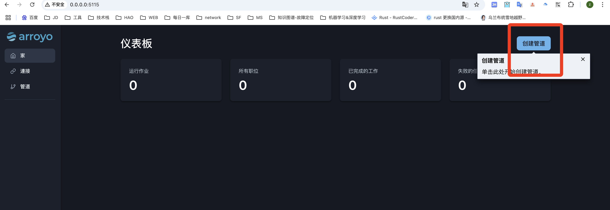

# 地址

```
https://github.com/ArroyoSystems/arroyo

文档
https://doc.arroyo.dev/getting-started
```


# 案例 

docker 和arroy 构建天气识别

```
https://mp.weixin.qq.com/s/KGCW6ly2wZrDr3YdV0nuWw
```


## docker file

```
version: '3'

services:
  rust:
    image: rust:latest
    container_name: rust_container
    tty: true
    volumes:
      - .:/app
    working_dir: /app
    command: bash
    networks:
      - my_network
  arroyo:
    image: ghcr.io/arroyosystems/arroyo-single:latest
    container_name: arroyo
    ports:
      - 8000:8000
      - 5115:5115
    networks:
      - my_network
    volumes:
      - arroyo_data:/var/lib/postgresql/data
  zookeeper:
    image: confluentinc/cp-zookeeper:latest
    container_name: zookeeper
    environment:
      ZOOKEEPER_CLIENT_PORT: 2181
      ZOOKEEPER_TICK_TIME: 2000
    networks:
      - my_network

  kafka:
    image: confluentinc/cp-kafka:latest
    container_name: kafka
    depends_on:
      - zookeeper
    ports:
      - 9092:9092
      - 9093:9093
    environment:
      KAFKA_BROKER_ID: 1
      KAFKA_ZOOKEEPER_CONNECT: zookeeper:2181
      KAFKA_ADVERTISED_LISTENERS: PLAINTEXT://kafka:9092,PLAINTEXT_HOST://localhost:9093
      KAFKA_LISTENER_SECURITY_PROTOCOL_MAP: PLAINTEXT:PLAINTEXT,PLAINTEXT_HOST:PLAINTEXT
      KAFKA_INTER_BROKER_LISTENER_NAME: PLAINTEXT
      KAFKA_OFFSETS_TOPIC_REPLICATION_FACTOR: 1
    networks:
      - my_network

  cmak:
    image: hlebalbau/kafka-manager:latest
    container_name: cmak
    depends_on:
      - zookeeper
      - kafka
    ports:
      - "9010:9000"
    environment:
      ZK_HOSTS: "zookeeper:2181"
      APPLICATION_SECRET: "random-secret"
    networks:
      - my_network

networks:
  my_network:
volumes:
  arroyo_data:
```


```
localhost:5115
```


