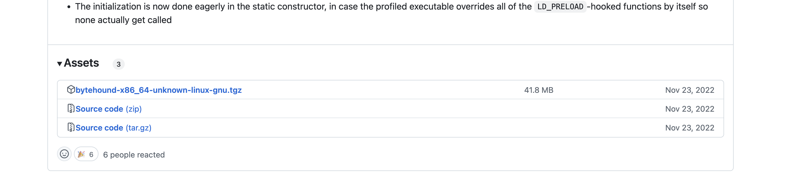
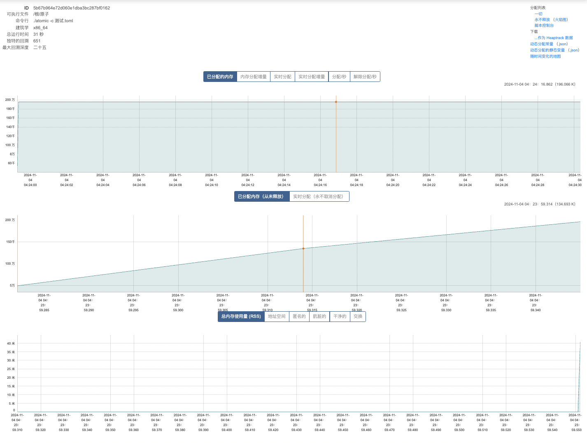
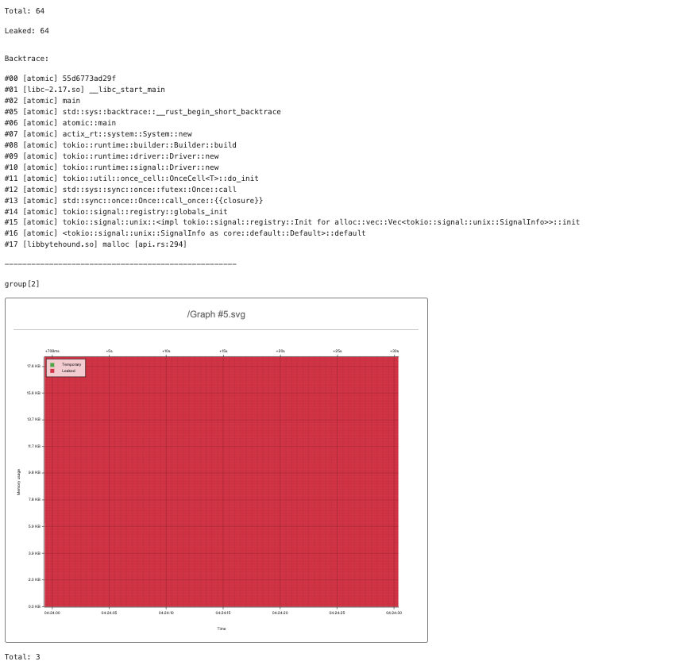
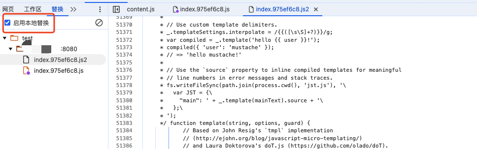

# 1、安装bytehound工具


1、**必要条件**

1. **linux环境**
2. **Rust nightly 环境**

2、下载工具并编译

```
git clone https://github.com/koute/bytehound.git
cd bytehound

##
cargo build --release -p bytehound-preload
## 安装编译之前 要装Yarn  看第二步的安装yarn
cargo build --release -p bytehound-cli
```


3、获取文件

```
target/release/libbytehound.so and target/release/bytehound
```


## 2、安装 yarn

### 1. 安装 Node.js

Yarn 依赖于 Node.js，因此你需要确保系统上安装了 Node.js。你可以通过以下命令检查：

```bash
node -v
```

如果没有安装 Node.js，可以使用以下方法之一安装：

- **使用 Node Version Manager (nvm)**：

  ```bash
  curl -o- https://raw.githubusercontent.com/nvm-sh/nvm/v0.39.5/install.sh | bash
  source ~/.bashrc
  nvm install node
  ```

- **使用包管理器**：

  - Ubuntu/Debian

    ：

    ```bash
    curl -fsSL https://deb.nodesource.com/setup_18.x | sudo -E bash -
    sudo apt-get install -y nodejs
    ```

  - CentOS/RHEL

    ：

    ```bash
    curl -fsSL https://rpm.nodesource.com/setup_18.x | sudo bash -
    sudo yum install -y nodejs
    ```

### 2. 安装 Yarn

一旦 Node.js 安装完成，你可以安装 Yarn。以下是一些常见的安装方法：

- **通过 npm（Node.js 包管理器）**：

  ```bash
  npm install --global yarn
  ```

- **通过 Yarn 官方仓库（推荐）**：

  - **Ubuntu/Debian**：

    ```bash
    curl -sS https://dl.yarnpkg.com/debian/pubkey.gpg | sudo apt-key add -
    echo "deb https://dl.yarnpkg.com/debian/ stable main" | sudo tee /etc/apt/sources.list.d/yarn.list
    sudo apt update && sudo apt install yarn
    ```

  - **CentOS/RHEL**：

    ```bash
    curl --silent --location https://dl.yarnpkg.com/rpm/yarn.repo | sudo tee /etc/yum.repos.d/yarn.repo
    sudo yum install yarn
    ```

### 3. 验证安装

安装完成后，验证 Yarn 是否安装成功：

```bash
yarn -v
```

### 4. 配置环境变量（如有必要）


## 3、nmp国内源安装

如果你想使用国内的 npm 源来安装 Yarn，可以使用淘宝的 cnpm 或者直接配置 npm 的 registry。以下是这两种方法的具体步骤：

### 方法一：使用 cnpm

1. **安装 cnpm**：
   你需要先安装 cnpm，这是淘宝提供的 npm 客户端。
   ```bash
   npm install -g cnpm --registry=https://registry.npmmirror.com
   ```

2. **使用 cnpm 安装 Yarn**：
   使用 cnpm 安装 Yarn。
   ```bash
   cnpm install -g yarn
   ```

### 方法二：配置 npm registry

1. **临时使用淘宝源安装 Yarn**：
   你可以在安装命令中临时指定 registry。
   ```bash
   npm install -g yarn --registry=https://registry.npmmirror.com
   ```

2. **永久设置 npm 的 registry 为淘宝源**：
   如果你经常需要使用淘宝源，可以直接将 npm 的默认 registry 设置为淘宝源。
   ```bash
   npm config set registry https://registry.npmmirror.com
   ```

   然后直接安装 Yarn：
   ```bash
   npm install -g yarn
   ```

### 验证安装

无论使用哪种方法安装完 Yarn 后，你可以通过以下命令验证是否安装成功：
```bash
yarn --version
```

这会返回 Yarn 的版本号，表示安装成功。这样可以确保你使用的是国内的 npm 源，从而加快安装速度。


## 4、升级linux到5.17以上

[centos7.9 内核3.10升级到5.15](https://www.jianshu.com/p/46fdfb146f05)

在 CentOS 上升级内核，可以通过 `elrepo` 仓库来安装更新的内核版本。步骤如下：

1. **安装 ELRepo 仓库：**

   

   ```bash
   sudo rpm --import https://www.elrepo.org/RPM-GPG-KEY-elrepo.org
   sudo yum install https://www.elrepo.org/elrepo-release-7.el7.elrepo.noarch.rpm
   ```

2. **安装最新的主线内核：**

   

   ```bash
   sudo yum --enablerepo=elrepo-kernel install kernel-ml
   ```

   `kernel-ml` 包安装最新的主线稳定内核版本。

3. **更新 GRUB：**
   安装完成后，你需要确保 GRUB 使用的是新内核。先检查当前系统可用的内核版本：

   

   ```bash
   awk -F\' '$1=="menuentry " {print i++ " : " $2}' /etc/grub2.cfg
   ```

   然后，设置 GRUB 引导最新安装的内核：

   

   ```bash
   sudo grub2-set-default 0
   ```

4. **重启系统：**
   完成内核安装和 GRUB 配置后，重启系统以应用新的内核：

   

   ```bash
   sudo reboot
   ```

5. **验证内核版本：**
   系统重启后，检查是否使用了新的内核：

   

   ```bash
   uname -r
   ```

网上一般的教程是这样做的，但是访问ELRepo 发现，centos7版本的不再提供有效的下载地址，可以访问这个地址下载rpm包，再手动安装


```ruby
wget https://dl.lamp.sh/kernel/el7/kernel-ml-5.15.63-1.el7.x86_64.rpm 
wget https://dl.lamp.sh/kernel/el7/kernel-ml-devel-5.15.63-1.el7.x86_64.rpm 
wget https://dl.lamp.sh/kernel/el7/kernel-ml-headers-5.15.63-1.el7.x86_64.rpm 
wget https://dl.lamp.sh/kernel/el7/kernel-ml-tools-5.15.63-1.el7.x86_64.rpm 
wget https://dl.lamp.sh/kernel/el7/kernel-ml-tools-libs-5.15.63-1.el7.x86_64.rpm 
wget https://dl.lamp.sh/kernel/el7/kernel-ml-tools-libs-devel-5.15.63-1.el7.x86_64.rpm


wget https://dl.lamp.sh/kernel/el7/kernel-ml-5.18.16-1.el7.x86_64.rpm
wget https://dl.lamp.sh/kernel/el7/kernel-ml-devel-5.18.16-1.el7.x86_64.rpm 
wget https://dl.lamp.sh/kernel/el7/kernel-ml-headers-5.18.16-1.el7.x86_64.rpm 
wget https://dl.lamp.sh/kernel/el7/kernel-ml-tools-5.18.16-1.el7.x86_64.rpm 
wget https://dl.lamp.sh/kernel/el7/kernel-ml-tools-libs-5.18.16-1.el7.x86_64.rpm 
wget https://dl.lamp.sh/kernel/el7/kernel-ml-tools-libs-devel-5.18.16-1.el7.x86_64.rpm


```

执行 yum localinstall kernel-ml-* -y --skip-broken 代替上述1/2操作

# 2、问题汇总

## 1、stdatomic.h：没有那个文件或目录 Gcc版本过低


```
he following warnings were emitted during compilation:

warning: In file included from c_src/mimalloc/include/mimalloc-types.h:13:0,
warning:                  from c_src/mimalloc/include/mimalloc-internal.h:11,
warning:                  from c_src/mimalloc/src/static.c:17:
warning: c_src/mimalloc/include/mimalloc-atomic.h:39:23: 致命错误：stdatomic.h：没有那个文件或目录
warning:  #include <stdatomic.h>
warning:                        ^
warning: 编译中断。

error: failed to run custom build command for `libmimalloc-sys v0.1.25 (/root/bytehound/bytehound/mimalloc_rust/libmimalloc-sys)`

Caused by:
  process didn't exit successfully: `/root/bytehound/bytehound/target/release/build/libmimalloc-sys-f57a21cf52198850/build-script-build` (exit status: 1)
  --- stdout
  OPT_LEVEL = Some("3")
  TARGET = Some("x86_64-unknown-linux-gnu")
  HOST = Some("x86_64-unknown-linux-gnu")
  CC_x86_64-unknown-linux-gnu = None
  CC_x86_64_unknown_linux_gnu = None
  HOST_CC = None
  CC = None
  CFLAGS_x86_64-unknown-linux-gnu = None
  CFLAGS_x86_64_unknown_linux_gnu = None
  HOST_CFLAGS = None
  CFLAGS = None
  CRATE_CC_NO_DEFAULTS = None
  DEBUG = Some("true")
  CARGO_CFG_TARGET_FEATURE = Some("fxsr,llvm14-builtins-abi,sse,sse2")
  CC_x86_64-unknown-linux-gnu = None
  CC_x86_64_unknown_linux_gnu = None
  HOST_CC = None
  CC = None
  CFLAGS_x86_64-unknown-linux-gnu = None
  CFLAGS_x86_64_unknown_linux_gnu = None
  HOST_CFLAGS = None
  CFLAGS = None
  CRATE_CC_NO_DEFAULTS = None
  CARGO_CFG_TARGET_FEATURE = Some("fxsr,llvm14-builtins-abi,sse,sse2")
  running: "cc" "-O3" "-ffunction-sections" "-fdata-sections" "-fPIC" "-g" "-fno-omit-frame-pointer" "-m64" "-I" "c_src/mimalloc/include" "-I" "c_src/mimalloc/src" "-Wall" "-Wextra" "-ftls-model=initial-exec" "-DMI_DEBUG=0" "-o" "/root/bytehound/bytehound/target/release/build/libmimalloc-sys-bd1db5b7b2544884/out/c_src/mimalloc/src/static.o" "-c" "c_src/mimalloc/src/static.c"
  cargo:warning=In file included from c_src/mimalloc/include/mimalloc-types.h:13:0,
  cargo:warning=                 from c_src/mimalloc/include/mimalloc-internal.h:11,
  cargo:warning=                 from c_src/mimalloc/src/static.c:17:
  cargo:warning=c_src/mimalloc/include/mimalloc-atomic.h:39:23: 致命错误：stdatomic.h：没有那个文件或目录
  cargo:warning= #include <stdatomic.h>
  cargo:warning=                       ^
  cargo:warning=编译中断。
  exit status: 1

  --- stderr


  error occurred: Command "cc" "-O3" "-ffunction-sections" "-fdata-sections" "-fPIC" "-g" "-fno-omit-frame-pointer" "-m64" "-I" "c_src/mimalloc/include" "-I" "c_src/mimalloc/src" "-Wall" "-Wextra" "-ftls-model=initial-exec" "-DMI_DEBUG=0" "-o" "/root/bytehound/bytehound/target/release/build/libmimalloc-sys-bd1db5b7b2544884/out/c_src/mimalloc/src/static.o" "-c" "c_src/mimalloc/src/static.c" with args "cc" did not execute successfully (status code exit status: 1).


warning: build failed, waiting for other jobs to finish...
```


更换阿里源

```
cd /etc/yum.repos.d/
mkdir bak
/bin/mv -f *.* bak
wget -O /etc/yum.repos.d/CentOS-Base.repo https://mirrors.aliyun.com/repo/Centos-7.repo


升级gcc
sudo yum install centos-release-scl

sudo yum install devtoolset-9-gcc*

scl enable devtoolset-9 bash

gcc -v

gcc version 9.3.1 20200408 (Red Hat 9.3.1-2) (GCC)

```


# 3、开始使用

[--](https://heziah.top/posts/notion/bytehound-guidelines/#advanced-usage)


[手册](https://koute.github.io/bytehound/api_reference/MapList/only_jemalloc.html)

```
1、下载工具
https://github.com/koute/bytehound/releases/tag/0.11.0
```




2、启动服务

可以指定端口

```
$ export MEMORY_PROFILER_LOG=warn
$ LD_PRELOAD=./libbytehound.so ./your_application
$ ./bytehound server -i 0.0.0.0 memory-profiling_*.dat
```

3、服务查看




**脚本控制台**

```
graph()
    .add("Leaked", allocations().only_leaked())
    .add("Temporary", allocations())
    .save();
    
    let groups = allocations()
    .only_leaked()
    .group_by_backtrace()
        .sort_by_size();

graph().add(groups).save();

fn analyze_group(list) {
    let list_all = allocations().only_matching_backtraces(list);

    graph()
        .add("Leaked", list_all.only_leaked())
        .add("Temporary", list_all)
        .save();

    println("Total: {}", list_all.len());
    println("Leaked: {}", list_all.only_leaked().len());
    println();
    println("Backtrace:");
    println(list_all[0].backtrace().strip());
}
for i in 0..groups.len() {
    println("group[{}]", i);
    analyze_group(groups[i]);
    println("----------------------------------------------------");
}
```




4、注意事项

1. 在linux内核5.17以上进行
2. 打开浏览器的时候 请求的 `http://localhost:8080/list`如下操作

```
1、使用浏览器开发者工具
打开开发者工具：

2、在浏览器中按 F12 或右键点击页面选择“检查”以打开开发者工具。
找到并修改 JavaScript 文件：

3、在开发者工具中，选择“Sources”标签。
在左侧面板中找到并选择需要修改的 JavaScript 文件。
你可以直接在此处编辑代码，但这些修改仅在当前会话中有效，并且页面刷新后会丢失。
使用“Overrides”功能（仅限 Chrome）：

4、在“Sources”标签下，点击右侧的“Overrides”面板。
启用“Enable Local Overrides”功能，并选择一个本地文件夹以存储覆盖文件。
在左侧面板中右键点击需要覆盖的文件，选择“Save for overrides”。
这样，你可以在本地编辑并保存文件，浏览器会在每次加载页面时使用你修改后的版本。

if esle 去了 改成 sourceUrl = window.location.origin;
```





# 5、稳定版本

## 用法

使用 bytehound 运行您的应用程序来收集内存使用数据。

```
export MEMORY_PROFILER_LOG=warn
LD_PRELOAD=./libbytehound.so ./your_application
```

下面是一个示例脚本，它构建 Rust 项目的“release-debug”版本并运行它。

```
cargo build --profile release-debug
export MEMORY_PROFILER_LOG=warn
LD_PRELOAD=~/.local/lib/libbytehound.so ../../target/release-debug/ofcp_test play_r1 \
    --five-cards "7c Js Qs 3d 2s" \
    --num-sim1 10 \
    --num-sim2 10 \
    --num-sim3 10 \
    --num-sim4 10
```

启动 Web 服务器来可视化内存分析数据。

```
bytehound server --port 9090 -i 0.0.0.0 memory-profiling_*.dat
```