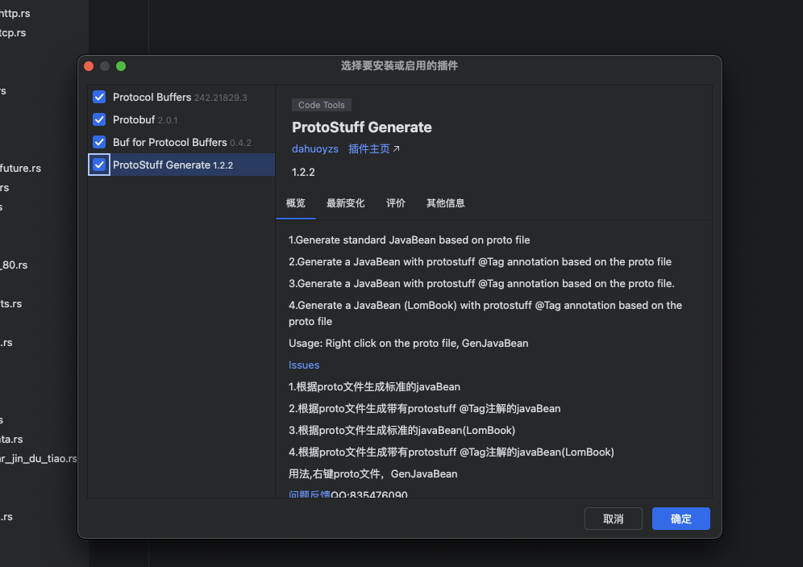

# 1、安装 Protocol Buffers 编译器 (protoc)

#### 1. 安装 Protocol Buffers 编译器 (protoc)

首先，你需要安装 Protocol Buffers 编译器，它用于从`.proto`文件生成 Rust 代码。

#### 2. 安装 Prost 插件

接下来，你需要安装 Prost 插件。Prost 插件是一个`protoc`的插件，用于生成 Rust 代码。

```
[dependencies]
prost = "0.12"
# Only necessary if using Protobuf well-known types:
prost-types = "0.12"
```

#### 3. 创建 Protocol Buffers 文件

创建一个名为`hello.proto`的文件，并定义你的 Protocol Buffers 消息：

```
syntax = "proto3";

package hello;

message Greeting {
  string first_name = 1;
  string last_name = 2;
}
```

#### 4. 生成 Rust 代码

使用`protoc`编译器和 Prost 插件生成 Rust 代码：

```
protoc --rust_out=. --proto_path=. hello.proto
```

这将在当前目录下生成`hello.rs`文件。

#### 5. 使用生成的 Rust 代码

在你的 Rust 项目中，添加生成的代码文件，并使用它：

```
use hello::Greeting;

fn main() {
    let name = Greeting {
        first_name: "John".to_string(),
        last_name: "Doe".to_string(),
    };

    // 你可以序列化和反序列化 Protocol Buffers 消息
    let bytes = prost::Message::encode_to_vec(&name);
    let decoded_name = Greeting::decode(&bytes[..]).unwrap();
    println!("Decoded name: {} {}", decoded_name.first_name, decoded_name.last_name);
}
```

### 进阶使用 Prost

#### 1.**「扩展和自定义选项」**

Prost 允许你使用 Protocol Buffers 的扩展和自定义选项。你可以定义自己的扩展，并在生成的 Rust 代码中使用它们。

```
// 定义一个扩展
extend google.protobuf.FieldOptions {
  bool my_option = 56367;
}

// 使用扩展
message MyMessage {
  option (my_option) = true;
  string data = 1;
}
```

#### 2.**「异步序列化和反序列化」**

Prost 支持异步序列化和反序列化，这对于处理大量数据或需要避免阻塞线程的应用程序非常有用。

```
use prost::Message;
use tokio::io::{AsyncReadExt, AsyncWriteExt};

async fn read_message<R: AsyncReadExt>(reader: &mut R) -> Result<MyMessage, prost::DecodeError> {
    let mut buf = Vec::new();
    reader.read_to_end(&mut buf).await?;
    MyMessage::decode(&buf)
}

async fn write_message<W: AsyncWriteExt>(writer: &mut W, message: &MyMessage) -> Result<(), prost::EncodeError> {
    let mut buf = Vec::new();
    message.encode(&mut buf)?;
    writer.write_all(&buf).await
}
```

#### 3.**「使用第三方类型」**

Prost 允许你使用第三方定义的类型，例如`prost-types`中的时间戳。

```
syntax = "proto3";

import "google/protobuf/timestamp.proto";

message Event {
  google.protobuf.Timestamp event_time = 1;
  string description = 2;
}
```

#### 4.**「优化性能」**

为了优化性能，你可以使用`Vec`作为缓冲区，减少在序列化和反序列化过程中的内存分配。

```
let mut buf = Vec::with_capacity(estimated_size);
my_message.encode(&mut buf)?;
```

#### 5.**「集成测试」**

编写集成测试来验证序列化和反序列化是否按预期工作。

```
#[cfg(test)]
mod tests {
    use super::*;

    #[test]
    fn test_round_trip() {
        let original = MyMessage {
            // 初始化消息...
        };

        let encoded = Message::encode_to_vec(&original);
        let decoded = MyMessage::decode(&encoded[..]).unwrap();

        assert_eq!(original, decoded);
    }
}
```

#### 6.**「多态消息」**

使用`oneof`特性来实现多态消息，这允许消息包含多个字段中的一个。

```
message Variant {
  oneof data {
    string string_data = 1;
    int32 int_data = 2;
  }
}
```

#### 7.**「自定义派生属性」**

Prost 允许你使用自定义派生属性来修改生成的代码。

```
message Custom {
  option (prost.custom) = "derive(CustomTrait)";
  string field = 1;
}
```

#### 8.**「服务定义和 gRPC」**

如果你需要使用 gRPC，Prost 也支持服务定义，可以生成 gRPC 服务的 Rust 代码。

```
service MyService {
  rpc MyMethod(RequestParams) returns (ResponseValue);
}

message RequestParams {
  // ...
}

message ResponseValue {
  // ...
}
```

#### 9.**「工具链集成」**

将 Prost 集成到你的构建系统（如 Cargo）和持续集成流程中，以确保`.proto`文件的更新能够及时反映到生成的 Rust 代码中。

#### 10.**「贡献 Prost」**

阅读 Prost 的源代码，了解其工作原理，并考虑为其贡献代码或文档。

```
// 贡献代码通常从了解项目开始，然后是阅读文档、寻找 issue 或提出 PR
```

通过深入探索 Prost 的这些进阶特性，你可以更有效地利用 Protocol Buffers 来提升 Rust 项目的数据序列化性能和安全性。


## IDE 插件



