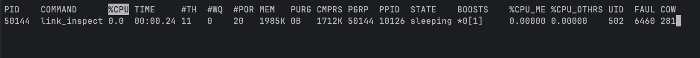
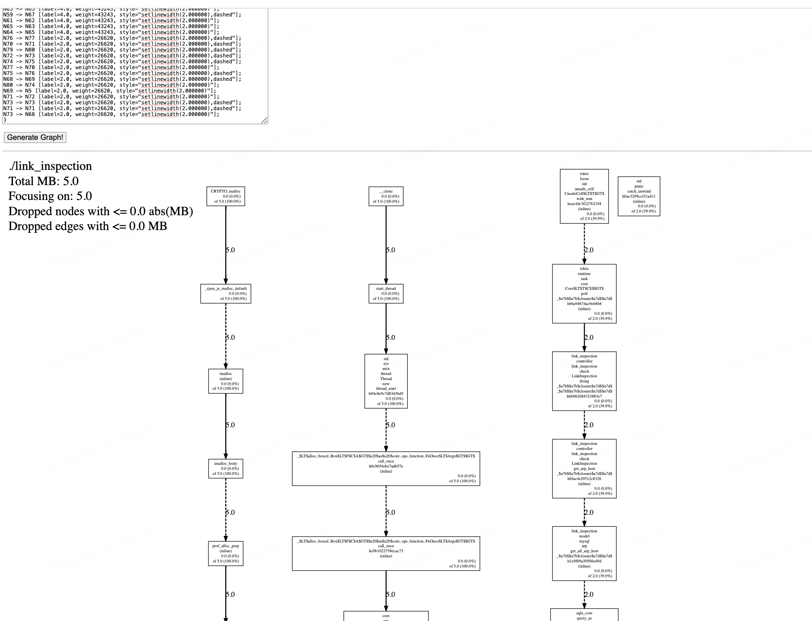

# 1 rust 内存飙升分析

本文章，我会采用jemalloc-sys``````jemallocator``````jemalloc-ctl这三个 Rust 库来进行内存的 profile，这三个库的功能主要是：

- `jemalloc-sys`: 封装 jemalloc。
- `jemallocator:` 实现了 Rust 的 GlobalAlloc，用来替换默认的内存分配器。
- `jemalloc-ctl`: 提供了对于 mallctl 的封装，可以用来进行 tuning、动态配置分配器的配置、以及获取分配器的统计信息等。


## 1.1 jemalloc

jemalloc是一款优秀的内存分配器，已经广泛应用于多个程序中，例如Redis、MySQL等。

在使用jemalloc时，首先需要检查当前系统是否已经安装了jemalloc分配器，如果未安装，则需要进行安装。

## 1.2 jemalloc安装

对于Linux用户，可以使用yum等命令进行jemalloc的安装。

[-](https://blog.csdn.net/chen134225/article/details/129539950)

```
一、安装jemalloc
1.1、下载源码
wget https://github.com/jemalloc/jemalloc/archive/refs/tags/5.3.0.tar.gz

1.2、解压源码包
tar -zxv -f 5.3.0.tar.gz

1.3、编译并安装
cd jemalloc-5.3.0
./autogen.sh 在这个文件里面加上-configure后面-enable-prof参数
sudo make
sudo make install

由于要生成jeprof工具，所以要在autogen.sh文件中-configure后面-enable-prof参数

#!/bin/sh
#autogen.sh文件  
for i in autoconf; do
    echo "$i"
    $i
    if [ $? -ne 0 ]; then
        echo "Error $? in $i"
        exit 1
    fi
done

echo "./configure --enable-autogen $@"
./configure --enable-autogen --enable-prof $@ # 在这一行加
if [ $? -ne 0 ]; then
    echo "Error $? in ./configure"
    exit 1
fi

要在执行./autogen.sh之前加上

生成的jeprof工具在jemalloc-5.3.0/bin/文件夹中

二、程序启动准备
需要export两个环境变量，libjemalloc.so.2的绝对路径和jemalloc的参数

export LD_PRELOAD=“/usr/local/lib/libjemalloc.so.2”
export MALLOC_CONF=“prof_leak:true,lg_prof_sample:0,prof:true,prof_prefix:jeprof.out,prof_final:true,lg_prof_interval:30”

这里几个参数的含义分别为：

prof_leak：是否打开内存卸扣报告
lg_prof_sample：采样内存间隔，即每间隔分配多少内存启动一次采样
prof：这个参数在编译的时候就指定了
prof_prefix：采样文件名的前缀
prof_final：转储最终的内存使用情况
lg_prof_interval：每分配多少内存转储一次

```

对于Mac用户，可以使用brew进行jemalloc的安装。

```
brew install jemalloc
```

安装完成后，我们便可以开始使用jemalloc。

 


## 1.3 jeproof 参数

```
[root@A03-R05-I194-149-0797341 link_inspection-test]#  /export/sofeware/jemalloc/jemalloc-5.3.0/bin/jeprof
Did not specify program

Usage:
jeprof [options] <program> <profiles>
   <profiles> is a space separated list of profile names.
jeprof [options] <symbolized-profiles>
   <symbolized-profiles> is a list of profile files where each file contains
   the necessary symbol mappings  as well as profile data (likely generated
   with --raw).
jeprof [options] <profile>
   <profile> is a remote form.  Symbols are obtained from host:port/pprof/symbol

   Each name can be:
   /path/to/profile        - a path to a profile file
   host:port[/<service>]   - a location of a service to get profile from

   The /<service> can be /pprof/heap, /pprof/profile, /pprof/pmuprofile,
                         /pprof/growth, /pprof/contention, /pprof/wall,
                         /pprof/censusprofile(?:\?.*)?, or /pprof/filteredprofile.
   For instance:
     jeprof http://myserver.com:80/pprof/heap
   If /<service> is omitted, the service defaults to /pprof/profile (cpu profiling).
jeprof --symbols <program>
   Maps addresses to symbol names.  In this mode, stdin should be a
   list of library mappings, in the same format as is found in the heap-
   and cpu-profile files (this loosely matches that of /proc/self/maps
   on linux), followed by a list of hex addresses to map, one per line.

   For more help with querying remote servers, including how to add the
   necessary server-side support code, see this filename (or one like it):

   /usr/doc/gperftools-2.0/pprof_remote_servers.html

Options:
   --cum               Sort by cumulative data
   --base=<base>       Subtract <base> from <profile> before display
   --interactive       Run in interactive mode (interactive "help" gives help) [default]
   --seconds=<n>       Length of time for dynamic profiles [default=30 secs]
   --add_lib=<file>    Read additional symbols and line info from the given library
   --lib_prefix=<dir>  Comma separated list of library path prefixes

Reporting Granularity:
   --addresses         Report at address level
   --lines             Report at source line level
   --functions         Report at function level [default]
   --files             Report at source file level

Output type:
   --text              Generate text report
   --callgrind         Generate callgrind format to stdout
   --gv                Generate Postscript and display
   --evince            Generate PDF and display
   --web               Generate SVG and display
   --list=<regexp>     Generate source listing of matching routines
   --disasm=<regexp>   Generate disassembly of matching routines
   --symbols           Print demangled symbol names found at given addresses
   --dot               Generate DOT file to stdout
   --ps                Generate Postcript to stdout
   --pdf               Generate PDF to stdout
   --svg               Generate SVG to stdout
   --gif               Generate GIF to stdout
   --raw               Generate symbolized jeprof data (useful with remote fetch)
   --collapsed         Generate collapsed stacks for building flame graphs
                       (see http://www.brendangregg.com/flamegraphs.html)

Heap-Profile Options:
   --inuse_space       Display in-use (mega)bytes [default]
   --inuse_objects     Display in-use objects
   --alloc_space       Display allocated (mega)bytes
   --alloc_objects     Display allocated objects
   --show_bytes        Display space in bytes
   --drop_negative     Ignore negative differences

Contention-profile options:
   --total_delay       Display total delay at each region [default]
   --contentions       Display number of delays at each region
   --mean_delay        Display mean delay at each region

Call-graph Options:
   --nodecount=<n>     Show at most so many nodes [default=80]
   --nodefraction=<f>  Hide nodes below <f>*total [default=.005]
   --edgefraction=<f>  Hide edges below <f>*total [default=.001]
   --maxdegree=<n>     Max incoming/outgoing edges per node [default=8]
   --focus=<regexp>    Focus on backtraces with nodes matching <regexp>
   --thread=<n>        Show profile for thread <n>
   --ignore=<regexp>   Ignore backtraces with nodes matching <regexp>
   --scale=<n>         Set GV scaling [default=0]
   --heapcheck         Make nodes with non-0 object counts
                       (i.e. direct leak generators) more visible
   --retain=<regexp>   Retain only nodes that match <regexp>
   --exclude=<regexp>  Exclude all nodes that match <regexp>

Miscellaneous:
   --tools=<prefix or binary:fullpath>[,...]   $PATH for object tool pathnames
   --test              Run unit tests
   --help              This message
   --version           Version information
   --debug-syms-by-id  (Linux only) Find debug symbol files by build ID as well as by name

Environment Variables:
   JEPROF_TMPDIR        Profiles directory. Defaults to $HOME/jeprof
   JEPROF_TOOLS         Prefix for object tools pathnames

Examples:

jeprof /bin/ls ls.prof
                       Enters "interactive" mode
jeprof --text /bin/ls ls.prof
                       Outputs one line per procedure
jeprof --web /bin/ls ls.prof
                       Displays annotated call-graph in web browser
jeprof --gv /bin/ls ls.prof
                       Displays annotated call-graph via 'gv'
jeprof --gv --focus=Mutex /bin/ls ls.prof
                       Restricts to code paths including a .*Mutex.* entry
jeprof --gv --focus=Mutex --ignore=string /bin/ls ls.prof
                       Code paths including Mutex but not string
jeprof --list=getdir /bin/ls ls.prof
                       (Per-line) annotated source listing for getdir()
jeprof --disasm=getdir /bin/ls ls.prof
                       (Per-PC) annotated disassembly for getdir()

jeprof http://localhost:1234/
                       Enters "interactive" mode
jeprof --text localhost:1234
                       Outputs one line per procedure for localhost:1234
jeprof --raw localhost:1234 > ./local.raw
jeprof --text ./local.raw
                       Fetches a remote profile for later analysis and then
                       analyzes it in text mode.

FATAL ERROR: Did not specify program
```


```
这是 jeprof 命令的使用说明：

用法：
jeprof [选项] <程序> <配置文件>
   <配置文件> 是一个以空格分隔的配置文件名列表。
jeprof [选项] <符号化的配置文件>
   <符号化的配置文件> 是一个配置文件列表，其中每个文件包含必要的符号映射以及配置文件数据（可能是使用 --raw 生成的）。
jeprof [选项] <配置文件>
   <配置文件> 是远程形式。从 host:port/pprof/symbol 获取符号。

   每个名称可以是：
   /path/to/profile        - 配置文件的路径
   host:port[/<service>]   - 获取配置文件的服务的位置

   /<service> 可以是 /pprof/heap、/pprof/profile、/pprof/pmuprofile、
                         /pprof/growth、/pprof/contention、/pprof/wall、
                         /pprof/censusprofile(?:\?.*)? 或 /pprof/filteredprofile。
   例如：
     jeprof http://myserver.com:80/pprof/heap
   如果省略了 /<service>，则服务默认为 /pprof/profile（CPU 分析）。
jeprof --symbols <程序>
   将地址映射到符号名称。在此模式下，stdin 应该是库映射的列表，格式与堆和 CPU 配置文件中的格式相同（这与 Linux 上的 /proc/self/maps 大致匹配），然后是要映射的十六进制地址列表，每行一个。

有关查询远程服务器的更多帮助，包括如何添加必要的服务器端支持代码，请参阅此文件名（或类似文件）：

/usr/doc/gperftools-2.0/pprof_remote_servers.html

选项：
   --cum               按累积数据排序
   --base=<base>       在显示之前从 <配置文件> 中减去 <base>
   --interactive       运行交互模式（交互 "help" 提供帮助）[默认]
   --seconds=<n>       动态配置文件的时间长度 [默认=30 秒]
   --add_lib=<file>    从给定库中读取附加符号和行信息
   --lib_prefix=<dir>  逗号分隔的库路径前缀列表

报告粒度：
   --addresses         按地址级别报告
   --lines             按源代码行级别报告
   --functions         按函数级别报告 [默认]
   --files             按源文件级别报告

输出类型：
   --text              生成文本报告
   --callgrind         生成 callgrind 格式到 stdout
   --gv                生成 Postscript 并显示
   --evince            生成 PDF 并显示
   --web               生成 SVG 并显示
   --list=<regexp>     生成与匹配的例程的源代码列表
   --disasm=<regexp>   生成与匹配的例程的反汇编代码
   --symbols           打印在给定地址找到的解码后的符号名称
   --dot               生成 DOT 文件到 stdout
   --ps                生成 Postcript 到 stdout
   --pdf               生成 PDF 到 stdout
   --svg               生成 SVG 到 stdout
   --gif               生成 GIF 到 stdout
   --raw               生成符号化的 jeprof 数据（与远程获取一起使用）

堆配置文件选项：
   --inuse_space       显示已使用（兆字节）
   --inuse_objects     显示已使用对象
   --alloc_space       显示已分配（兆字节）
   --alloc_objects     显示已分配对象
   --show_bytes        以字节显示空间
   --drop_negative     忽略负差异

竞争配置文件选项：
   --total_delay       显示每个区域的总延迟 [默认]
   --contentions       显示每个区域的延迟次数
   --mean_delay        显示每个区域的平均延迟

调用图选项：
   --nodecount=<n>     最多显示多少个节点 [默认=80]
   --nodefraction=<f>  隐藏小于 <f>*总数的节点 [默认=.005]
   --edgefraction=<f>  隐藏小于 <f>*总数的边 [默认=.001]
   --maxdegree=<n>     每个节点的最大入站/出站边数 [默认=8]
   --focus=<regexp>    关注与 <regexp> 匹配的回溯
   --thread=<n>        显示线程 <n> 的配置文件
   --ignore=<regexp>   忽略与 <regexp> 匹配的回溯
   --scale=<n>         设置 GV 缩放 [默认=0]
   --heapcheck         使具有非零对象计数（即直接泄漏生成器）更可见
   --retain=<regexp>   仅保留与 <regexp> 匹配的节点
   --exclude=<regexp>  排除与 <regexp> 匹配的所有节点

其他选项：
   --tools=<prefix or binary:fullpath>[,...]   对象工具路径名的 $PATH
   --test              运行单元测试
   --help              此消息
   --version           版本信息
   --debug-syms-by-id  （仅限 Linux）通过构建 ID 查找调试符号文件

环境变量：
   JEPROF_TMPDIR        配置文件目录。默认为 $HOME/jeprof
   JEPROF_TOOLS         对象工具路径名的前缀

示例：

jeprof /bin/ls ls.prof
                       进入 "交互" 模式
jeprof --text /bin/ls ls.prof
                       每个过程输出一行
jeprof --web /bin/ls ls.prof
                       在 Web 浏览器中显示带注释的调用图
jeprof --gv /bin/ls ls.prof
                       通过 'gv' 显示带注释的调用图
jeprof --gv --focus=Mutex /bin/ls ls.prof
                       限制包含 .*Mutex.* 条目的代码路径
jeprof --gv --focus=Mutex --ignore=string /bin/ls ls.prof
                       包含 Mutex 但不包含 string 的代码路径
jeprof --list=getdir /bin/ls ls.prof
                       匹配 getdir() 的（逐行）带注释的源代码列表
jeprof --disasm=getdir /bin/ls ls.prof
                       匹配 getdir() 的（逐个 PC）带注释的反汇编代码

jeprof http://localhost:1234/
                       进入 "交互" 模式
jeprof --text localhost:1234
                       输出 localhost:1234 的每个过程一行
jeprof --raw localhost:1234 > ./local.raw
jeprof --text ./local.raw
                       获取远程配置文件以供以后分析，然后在文本模式下进行分析。

致命错误：未指定程序
```

## 2 项目 部署

[-](https://blog.csdn.net/weixin_37902491/article/details/128103738)


## 2.1 **配置项目使用Jemalloc内存分配器**

声明Cargo.toml依赖

```
jemallocator = "0.5.0"
jemalloc-ctl = "0.5.0"
[dependencies.jemalloc-sys]
version = "0.5.3+5.3.0-patched"
features = ["stats", "profiling", "unprefixed_malloc_on_supported_platforms"]
[profile.release]
debug = true
```

## 2.2 **声明使用全局内存分配器**

```


#[global_allocator]
static GLOBAL: jemallocator::Jemalloc = jemallocator::Jemalloc;
fn main() {
	// do
}

声明定时任务导出heap文件
use jemalloc_sys::mallctl;
use std::os::raw::{c_char, c_int};
use std::ptr;
use std::thread::sleep;
use std::time::Duration;

pub fn spawn_dump() {
    let thread = std::thread::Builder::new().name("spawn_dump".to_owned());
    thread
        .spawn(|| loop {
            let r = dump();
            println!("---------------dump ret: {} -------------------", r);
            sleep(Duration::from_secs(10));
        })
        .unwrap();
}

fn dump() -> c_int {
    unsafe {
        mallctl(
            "prof.dump\0".as_bytes() as *const _ as *const c_char,
            ptr::null_mut(),
            ptr::null_mut(),
            ptr::null_mut(),
            0,
        )
    }
}
```

## 2.3 **生成prof文件**

**导环境变量_RJEM_MALLOC_CONF，开启prof**

```
mac
export _RJEM_MALLOC_CONF="prof:true,prof_prefix:/tmp/jeprof.out"

linux
export MALLOC_CONF="prof:true,prof_prefix:/tmp/jeprof.out"
```


**运行程序**

````
_RJEM_MALLOC_CONF="prof:true,prof_prefix:/Users/xxx/Desktop/Jd-work/link_inspection/jeprof.out" cargo  run -- -c  ./src/config/local.toml

或者指定二进制
````

**prof_prefix目录下查看对应的转储文件**

```
$ ll
total 696
-rw-r--r--  1 xxx  staff  90513 Nov 21 11:05 Cargo.lock
-rw-r--r--  1 xxx  staff   1013 Nov 21 11:09 Cargo.toml
-rwxr-xr-x  1 xx  staff     51 Nov 21 11:51 jeprof.out.7209.0.m0.heap
-rwxr-xr-x  1 xx  staff  21893 Nov 21 11:52 jeprof.out.7209.1.m1.heap

```


## 2.4 **使用jeprof 分析**
更多的jeprof使用可以直接查看官方文档

### 2.4.1 输出文本
执行命令

```
jeprof --text  ./target/release/test-dump --base /tmp/jeprof.out.10444.0.m0.heap /tmp/jeprof.out.10444.1.m1.heap
```


结果：

```
[root@A03-R05-I194-149-0797341 link_inspection-test]# /export/sofeware/jemalloc/jemalloc-5.3.0/bin/jeprof  --show_bytes   ./link_inspection  /export/App/link_inspection-test/jeprof.out.125730.0.m0.heap  /export/App/link_inspection-test/jeprof.out.125730.1.m1.heap
Using local file ./link_inspection.
Using local file /export/App/link_inspection-test/jeprof.out.125730.1.m1.heap.
Using local file /export/App/link_inspection-test/jeprof.out.125730.0.m0.heap.
Fetching 2 profiles, Be patient...
Using local file /export/App/link_inspection-test/jeprof.out.125730.1.m1.heap.
Using local file /export/App/link_inspection-test/jeprof.out.125730.0.m0.heap.
Welcome to jeprof!  For help, type 'help'.
(jeprof) top
Total: 5254007 B
 5254007 100.0% 100.0%  5254007 100.0% prof_backtrace_impl
       0   0.0% 100.0%   524312  10.0% ASN1_OBJECT_new
       0   0.0% 100.0%  1048629  20.0% ASN1_STRING_set
       0   0.0% 100.0%  4195117  79.8% ASN1_item_d2i
       0   0.0% 100.0%  4195117  79.8% ASN1_item_ex_d2i
       0   0.0% 100.0%  1048816  20.0% BUF_MEM_grow
       0   0.0% 100.0%  5254007 100.0% CRYPTO_malloc
       0   0.0% 100.0%   524304  10.0% EVP_add_cipher
       0   0.0% 100.0%   524304  10.0% OBJ_NAME_add
       0   0.0% 100.0%   524304  10.0% OPENSSL_add_all_algorithms_noconf
```




### 2.4.2 输出dot 图
执行命令

```
[root@A03-R05-I194-149-0797341 link_inspection-test]# /export/sofeware/jemalloc/jemalloc-5.3.0/bin/jeprof  --dot   ./link_inspection  /export/App/link_inspection-test/jeprof.out.125730.0.m0.heap  /export/App/link_inspection-test/jeprof.out.125730.1.m1.heap
Using local file ./link_inspection.
Using local file /export/App/link_inspection-test/jeprof.out.125730.1.m1.heap.
Using local file /export/App/link_inspection-test/jeprof.out.125730.0.m0.heap.
Fetching 2 profiles, Be patient...
Using local file /export/App/link_inspection-test/jeprof.out.125730.1.m1.heap.
Using local file /export/App/link_inspection-test/jeprof.out.125730.0.m0.heap.
Dropping nodes with <= 0.0 MB; edges with <= 0.0 abs(MB)
digraph "./link_inspection; 5.0 MB" {
node [width=0.375,height=0.25];
Legend [shape=box,fontsize=24,shape=plaintext,label="./link_inspection\lTotal MB: 5.0\lFocusing on: 5.0\lDropped nodes with <= 0.0 abs(MB)\lDropped edges with <= 0.0 MB\l"];
N1 [label="CRYPTO_malloc\n0.0 (0.0%)\rof 5.0 (100.0%)\r",shape=box,fontsize=8.0];
N2 [label="_$LT$alloc..boxed..Box$LT$F$C$A$GT$$u20$as$u20$core..ops..function..FnOnce$LT$Args$GT$$GT$\ncall_once\nh0c9654ebe7ad657e\n(inline)\n0.0 (0.0%)\rof 5.0 (100.0%)\r",shape=box,fontsize=8.0];
N3 [label="_$LT$alloc..boxed..Box$LT$F$C$A$GT$$u20$as$u20$core..ops..function..FnOnce$LT$Args$GT$$GT$\ncall_once\nhc0b1022758ecac73\n(inline)\n0.0 (0.0%)\rof 5.0 (100.0%)\r",shape=box,fontsize=8.0];
N4 [label="_$LT$futures_util..future..future..fuse..Fuse$LT$Fut$GT$$u20$as$u20$core..future..future..Future$GT$\npoll\nh97edaefb83f959b1\n0.0 (0.0%)\rof 5.0 (100.0%)\r",shape=box,fontsize=8.0];
N5 [label="_$LT$sqlx_core..ext..async_stream..TryAsyncStream$LT$T$GT$$u20$as$u20$futures_core..stream..Stream$GT$\npoll_next\nh329fdb5b9da999af\n0.0 (0.0%)\rof 5.0 (100.0%)\r",shape=box,fontsize=8.0];
N6 [label="_$LT$sqlx_core..ext..async_stream..TryAsyncStream$LT$T$GT$$u20$as$u20$futures_core..stream..Stream$GT$\npoll_next\nh329fdb5b9da999af\n(inline)\n0.0 (0.0%)\rof 5.0 (100.0%)\r",shape=box,fontsize=8.0];
N7 [label="_$LT$tokio..time..timeout..Timeout$LT$T$GT$$u20$as$u20$core..future..future..Future$GT$\npoll\nh3c97dc1e7de56a1e\n0.0 (0.0%)\rof 5.0 (100.0%)\r",shape=box,fontsize=8.0];
N8 [label="_$LT$tokio..time..timeout..Timeout$LT$T$GT$$u20$as$u20$core..future..future..Future$GT$\npoll\nhdb3604e2a3b34e9a\n0.0 (0.0%)\rof 5.0 (100.0%)\r",shape=box,fontsize=8.0];
N9 [label="_$LT$tokio..time..timeout..Timeout$LT$T$GT$$u20$as$u20$core..future..future..Future$GT$\npoll\nhdb3604e2a3b34e9a\n(inline)\n0.0 (0.0%)\rof 5.0 (100.0%)\r",shape=box,fontsize=8.0];
N10 [label="__clone\n0.0 (0.0%)\rof 5.0 (100.0%)\r",shape=box,fontsize=8.0];
N11 [label="_rjem_je_malloc_default\n0.0 (0.0%)\rof 5.0 (100.0%)\r",shape=box,fontsize=8.0];
N12 [label="_rjem_je_prof_backtrace\n0.0 (0.0%)\rof 5.0 (100.0%)\r",shape=box,fontsize=8.0];
N13 [label="_rjem_je_prof_tctx_create\n0.0 (0.0%)\rof 5.0 (100.0%)\r",shape=box,fontsize=8.0];
N14 [label="actix_server\nworker\nServerWorker\nstart\n_$u7b$$u7b$closure$u7d$$u7d$\nh2d195bf4a8f67e9c\n(inline)\n0.0 (0.0%)\rof 5.0 (100.0%)\r",shape=box,fontsize=8.0];
N15 [label="core\nops\nfunction\nFnOnce\ncall_once$u7b$$u7b$vtable.shim$u7d$$u7d$\nh828c62ebc6493af7\n0.0 (0.0%)\rof 5.0 (100.0%)\r",shape=box,fontsize=8.0];
N16 [label="core\nops\nfunction\nFnOnce\ncall_once$u7b$$u7b$vtable.shim$u7d$$u7d$\nh828c62ebc6493af7\n(inline)\n0.0 (0.0%)\rof 5.0 (100.0%)\r",shape=box,fontsize=8.0];
N17 [label="imalloc\n(inline)\n0.0 (0.0%)\rof 5.0 (100.0%)\r",shape=box,fontsize=8.0];
N18 [label="imalloc_body\n0.0 (0.0%)\rof 5.0 (100.0%)\r",shape=box,fontsize=8.0];
N19 [label="prof_alloc_prep\n(inline)\n0.0 (0.0%)\rof 5.0 (100.0%)\r",shape=box,fontsize=8.0];
N20 [label="prof_backtrace_impl\n5.0 (100.0%)\r",shape=box,fontsize=58.0];
N21 [label="sqlx_core\next\nasync_stream\nTryAsyncStream$LT$T$GT$\nnew\n_$u7b$$u7b$closure$u7d$$u7d$\nh8dfa09c23d3c6d9f\n(inline)\n0.0 (0.0%)\rof 5.0 (100.0%)\r",shape=box,fontsize=8.0];
N22 [label="sqlx_core\nmysql\nconnection\nestablish\n_$LT$impl$u20$sqlx_core..mysql..connection..MySqlConnection$GT$\nestablish\n_$u7b$$u7b$closure$u7d$$u7d$\nh9e6bdaa863772392\n(inline)\n0.0 (0.0%)\rof 5.0 (100.0%)\r",shape=box,fontsize=8.0];
N23 [label="sqlx_core\nmysql\nconnection\ntls\nmaybe_upgrade\n_$u7b$$u7b$closure$u7d$$u7d$\nh1caea9f0ee6c0dd9\n(inline)\n0.0 (0.0%)\rof 5.0 (100.0%)\r",shape=box,fontsize=8.0];
N24 [label="sqlx_core\nmysql\nconnection\ntls\nupgrade\n_$u7b$$u7b$closure$u7d$$u7d$\nh61f506c7fe819431\n0.0 (0.0%)\rof 5.0 (100.0%)\r",shape=box,fontsize=8.0];
N25 [label="sqlx_core\nmysql\noptions\nconnect\n_$LT$impl$u20$sqlx_core..connection..ConnectOptions$u20$for$u20$sqlx_core..mysql..options..MySqlConnectOptions$GT$\nconnect\n_$u7b$$u7b$closure$u7d$$u7d$\nh5f2dfc103fef6e97\n0.0 (0.0%)\rof 5.0 (100.0%)\r",shape=box,fontsize=8.0];
N26 [label="sqlx_core\nnet\ntls\nMaybeTlsStream$LT$S$GT$\nupgrade\n_$u7b$$u7b$closure$u7d$$u7d$\nh2da1a0982b29e089\n(inline)\n0.0 (0.0%)\rof 5.0 (100.0%)\r",shape=box,fontsize=8.0];
N27 [label="sqlx_core\npool\nPool$LT$DB$GT$\nacquire\n_$u7b$$u7b$closure$u7d$$u7d$\nh16a35aaeecf8a333\n(inline)\n0.0 (0.0%)\rof 5.0 (100.0%)\r",shape=box,fontsize=8.0];
N28 [label="sqlx_core\npool\nexecutor\n_$LT$impl$u20$sqlx_core..executor..Executor$u20$for$u20$$RF$sqlx_core..pool..Pool$LT$DB$GT$$GT$\nfetch_many\n_$u7b$$u7b$closure$u7d$$u7d$\n_$u7b$$u7b$closure$u7d$$u7d$\nh354d977c60caa775\n(inline)\n0.0 (0.0%)\rof 5.0 (100.0%)\r",shape=box,fontsize=8.0];
N29 [label="sqlx_core\npool\ninner\nPoolInner$LT$DB$GT$\nacquire\n_$u7b$$u7b$closure$u7d$$u7d$\n_$u7b$$u7b$closure$u7d$$u7d$\nh82378066bcb75c08\n(inline)\n0.0 (0.0%)\rof 5.0 (100.0%)\r",shape=box,fontsize=8.0];
N30 [label="sqlx_core\npool\ninner\nPoolInner$LT$DB$GT$\nacquire\n_$u7b$$u7b$closure$u7d$$u7d$\nh8287194e0fd99c62\n(inline)\n0.0 (0.0%)\rof 5.0 (100.0%)\r",shape=box,fontsize=8.0];
N31 [label="sqlx_core\npool\ninner\nPoolInner$LT$DB$GT$\nconnect\n_$u7b$$u7b$closure$u7d$$u7d$\nhe12bf7c3cab2c2b5\n(inline)\n0.0 (0.0%)\rof 5.0 (100.0%)\r",shape=box,fontsize=8.0];
N32 [label="start_thread\n0.0 (0.0%)\rof 5.0 (100.0%)\r",shape=box,fontsize=8.0];
N33 [label="std\npanic\ncatch_unwind\nhd239c57f79f1c211\n(inline)\n0.0 (0.0%)\rof 5.0 (100.0%)\r",shape=box,fontsize=8.0];
N34 [label="std\nsys\nunix\nthread\nThread\nnew\nthread_start\nh04c8e9c7d83d3bd5\n0.0 (0.0%)\rof 5.0 (100.0%)\r",shape=box,fontsize=8.0];
N35 [label="std\nsys_common\nbacktrace\n__rust_begin_short_backtrace\nh9dfe55f5630ffa5a\n0.0 (0.0%)\rof 5.0 (100.0%)\r",shape=box,fontsize=8.0];
N36 [label="std\nthread\nBuilder\nspawn_unchecked_\n_$u7b$$u7b$closure$u7d$$u7d$\nh6751b5fc353d8116\n(inline)\n0.0 (0.0%)\rof 5.0 (100.0%)\r",shape=box,fontsize=8.0];
N37 [label="std\nthread\nlocal\nLocalKey$LT$T$GT$\ntry_with\nh381ddc5830a1076e\n(inline)\n0.0 (0.0%)\rof 5.0 (100.0%)\r",shape=box,fontsize=8.0];
N38 [label="std\nthread\nlocal\nLocalKey$LT$T$GT$\nwith\nh3a9c8e6041c7f638\n(inline)\n0.0 (0.0%)\rof 5.0 (100.0%)\r",shape=box,fontsize=8.0];
N39 [label="tokio\nruntime\ncontext\nruntime\nenter_runtime\nh9835e776cebe2418\n0.0 (0.0%)\rof 5.0 (100.0%)\r",shape=box,fontsize=8.0];
N40 [label="tokio\nruntime\ncontext\nscoped\nScoped$LT$T$GT$\nset\nhef9c3a3e28c39382\n0.0 (0.0%)\rof 5.0 (100.0%)\r",shape=box,fontsize=8.0];
N41 [label="tokio\nruntime\ncontext\nset_scheduler\n_$u7b$$u7b$closure$u7d$$u7d$\nh0670b2aa30912b0f\n(inline)\n0.0 (0.0%)\rof 5.0 (100.0%)\r",shape=box,fontsize=8.0];
N42 [label="tokio\nruntime\ncontext\nset_scheduler\nha0a4e614d6a6d1ea\n0.0 (0.0%)\rof 5.0 (100.0%)\r",shape=box,fontsize=8.0];
N43 [label="tokio\nruntime\nruntime\nRuntime\nblock_on\nh934ef2ec3de81d8e\n0.0 (0.0%)\rof 5.0 (100.0%)\r",shape=box,fontsize=8.0];
N44 [label="tokio\nruntime\nruntime\nRuntime\nblock_on\nh934ef2ec3de81d8e\n(inline)\n0.0 (0.0%)\rof 5.0 (100.0%)\r",shape=box,fontsize=8.0];
N45 [label="tokio\nruntime\nscheduler\ncurrent_thread\nCoreGuard\nblock_on\n_$u7b$$u7b$closure$u7d$$u7d$\nh1eb4e7af24e855d6\n(inline)\n0.0 (0.0%)\rof 5.0 (100.0%)\r",shape=box,fontsize=8.0];
N46 [label="tokio\nruntime\nscheduler\ncurrent_thread\nCoreGuard\nblock_on\nh12ceef15eff71105\n0.0 (0.0%)\rof 5.0 (100.0%)\r",shape=box,fontsize=8.0];
N47 [label="tokio\nruntime\nscheduler\ncurrent_thread\nCoreGuard\nenter\n_$u7b$$u7b$closure$u7d$$u7d$\nh6c28f0fd157d001f\n(inline)\n0.0 (0.0%)\rof 5.0 (100.0%)\r",shape=box,fontsize=8.0];
N48 [label="tokio\nruntime\nscheduler\ncurrent_thread\nCoreGuard\nenter\nh39e92010f14c06bd\n(inline)\n0.0 (0.0%)\rof 5.0 (100.0%)\r",shape=box,fontsize=8.0];
N49 [label="tokio\nruntime\nscheduler\ncurrent_thread\nCurrentThread\nblock_on\n_$u7b$$u7b$closure$u7d$$u7d$\nhddcbf31d78848830\n(inline)\n0.0 (0.0%)\rof 5.0 (100.0%)\r",shape=box,fontsize=8.0];
N50 [label="tokio\nruntime\ncoop\nbudget\nh6f4716bb70ae1672\n(inline)\n0.0 (0.0%)\rof 4.5 (90.0%)\r",shape=box,fontsize=8.0];
N51 [label="tokio\nruntime\ncoop\nwith_budget\nhac18d5087a2a9ccd\n(inline)\n0.0 (0.0%)\rof 4.5 (90.0%)\r",shape=box,fontsize=8.0];
N52 [label="tokio\nruntime\nscheduler\ncurrent_thread\nContext\nenter\nh43c2eccf180fc9cf\n(inline)\n0.0 (0.0%)\rof 4.5 (90.0%)\r",shape=box,fontsize=8.0];
N53 [label="tokio\nruntime\nscheduler\ncurrent_thread\nContext\nrun_task\n_$u7b$$u7b$closure$u7d$$u7d$\nhaf0355df394123bf\n(inline)\n0.0 (0.0%)\rof 4.5 (90.0%)\r",shape=box,fontsize=8.0];
N54 [label="tokio\nruntime\nscheduler\ncurrent_thread\nContext\nrun_task\nh70f6feff7241b123\n0.0 (0.0%)\rof 4.5 (90.0%)\r",shape=box,fontsize=8.0];
N55 [label="tokio\nruntime\nscheduler\ncurrent_thread\nCoreGuard\nblock_on\n_$u7b$$u7b$closure$u7d$$u7d$\n_$u7b$$u7b$closure$u7d$$u7d$\nh3c3f20663ed6cd98\n(inline)\n0.0 (0.0%)\rof 4.5 (90.0%)\r",shape=box,fontsize=8.0];
N56 [label="tokio\nruntime\ntask\nLocalNotified$LT$S$GT$\nrun\nh6f991d0a4115f0b0\n(inline)\n0.0 (0.0%)\rof 4.5 (90.0%)\r",shape=box,fontsize=8.0];
N57 [label="native_tls\nTlsConnectorBuilder\nbuild\nh6e5df13950afd000\n0.0 (0.0%)\rof 4.5 (89.8%)\r",shape=box,fontsize=8.0];
N58 [label="native_tls\nimp\nTlsConnector\nnew\nh7cadebf40b2bf046\n0.0 (0.0%)\rof 4.5 (89.8%)\r",shape=box,fontsize=8.0];
N59 [label="openssl\nssl\nconnector\nSslConnector\nbuilder\nhbe554257ec11736c\n0.0 (0.0%)\rof 4.5 (89.8%)\r",shape=box,fontsize=8.0];
N60 [label="sqlx_core\nnet\ntls\nconfigure_tls_connector\n_$u7b$$u7b$closure$u7d$$u7d$\nh4c889bf9a639795f\n(inline)\n0.0 (0.0%)\rof 4.5 (89.8%)\r",shape=box,fontsize=8.0];
N61 [label="ASN1_item_d2i\n0.0 (0.0%)\rof 4.0 (79.8%)\r",shape=box,fontsize=8.0];
N62 [label="ASN1_item_ex_d2i\n0.0 (0.0%)\rof 4.0 (79.8%)\r",shape=box,fontsize=8.0];
N63 [label="PEM_X509_INFO_read_bio\n0.0 (0.0%)\rof 4.0 (79.8%)\r",shape=box,fontsize=8.0];
N64 [label="X509_STORE_set_default_paths\n0.0 (0.0%)\rof 4.0 (79.8%)\r",shape=box,fontsize=8.0];
N65 [label="X509_load_cert_crl_file\n0.0 (0.0%)\rof 4.0 (79.8%)\r",shape=box,fontsize=8.0];
N66 [label="asn1_ex_c2i\n0.0 (0.0%)\rof 4.0 (79.8%)\r",shape=box,fontsize=8.0];
N67 [label="openssl\nssl\nconnector\nSslConnector\nbuilder\nhbe554257ec11736c\n(inline)\n0.0 (0.0%)\rof 4.0 (79.8%)\r",shape=box,fontsize=8.0];
N68 [label="_$LT$futures_util..stream..stream..map..Map$LT$St$C$F$GT$$u20$as$u20$futures_core..stream..Stream$GT$\npoll_next\nh2412f68c74de1a0e\n0.0 (0.0%)\rof 2.0 (39.9%)\r",shape=box,fontsize=8.0];
N69 [label="_$LT$futures_util..stream..stream..map..Map$LT$St$C$F$GT$$u20$as$u20$futures_core..stream..Stream$GT$\npoll_next\nh2412f68c74de1a0e\n(inline)\n0.0 (0.0%)\rof 2.0 (39.9%)\r",shape=box,fontsize=8.0];
N70 [label="_$LT$futures_util..stream..try_stream..try_collect..TryCollect$LT$St$C$C$GT$$u20$as$u20$core..future..future..Future$GT$\npoll\nhbac0a94ff06b1ecd\n0.0 (0.0%)\rof 2.0 (39.9%)\r",shape=box,fontsize=8.0];
N71 [label="_$LT$futures_util..stream..try_stream..try_collect..TryCollect$LT$St$C$C$GT$$u20$as$u20$core..future..future..Future$GT$\npoll\nhbac0a94ff06b1ecd\n(inline)\n0.0 (0.0%)\rof 2.0 (39.9%)\r",shape=box,fontsize=8.0];
N72 [label="_$LT$futures_util..stream..try_stream..try_filter_map..TryFilterMap$LT$St$C$Fut$C$F$GT$$u20$as$u20$futures_core..stream..Stream$GT$\npoll_next\nh332e8da6f758224f\n0.0 (0.0%)\rof 2.0 (39.9%)\r",shape=box,fontsize=8.0];
N73 [label="_$LT$futures_util..stream..try_stream..try_filter_map..TryFilterMap$LT$St$C$Fut$C$F$GT$$u20$as$u20$futures_core..stream..Stream$GT$\npoll_next\nh332e8da6f758224f\n(inline)\n0.0 (0.0%)\rof 2.0 (39.9%)\r",shape=box,fontsize=8.0];
N74 [label="link_inspection\ncontroller\nlink_inspection\ncheck\nLinkInspection\ndoing\n_$u7b$$u7b$closure$u7d$$u7d$\n_$u7b$$u7b$closure$u7d$$u7d$\nhbb062684323883e7\n0.0 (0.0%)\rof 2.0 (39.9%)\r",shape=box,fontsize=8.0];
N75 [label="link_inspection\ncontroller\nlink_inspection\ncheck\nLinkInspection\nget_arp_host\n_$u7b$$u7b$closure$u7d$$u7d$\nh0fac4e29512c8326\n(inline)\n0.0 (0.0%)\rof 2.0 (39.9%)\r",shape=box,fontsize=8.0];
N76 [label="link_inspection\nmodel\nmysql\narp\nget_all_arp_host\n_$u7b$$u7b$closure$u7d$$u7d$\nh1e9f09a30500e49d\n(inline)\n0.0 (0.0%)\rof 2.0 (39.9%)\r",shape=box,fontsize=8.0];
N77 [label="sqlx_core\nquery_as\nQueryAs$LT$DB$C$O$C$A$GT$\nfetch_all\n_$u7b$$u7b$closure$u7d$$u7d$\nh8daa76640096e67d\n(inline)\n0.0 (0.0%)\rof 2.0 (39.9%)\r",shape=box,fontsize=8.0];
N78 [label="std\npanic\ncatch_unwind\nh0ac3299ccf31a411\n(inline)\n0.0 (0.0%)\rof 2.0 (39.9%)\r",shape=box,fontsize=8.0];
N79 [label="tokio\nloom\nstd\nunsafe_cell\nUnsafeCell$LT$T$GT$\nwith_mut\nheac4dc3f22762194\n(inline)\n0.0 (0.0%)\rof 2.0 (39.9%)\r",shape=box,fontsize=8.0];
N80 [label="tokio\nruntime\ntask\ncore\nCore$LT$T$C$S$GT$\npoll\n_$u7b$$u7b$closure$u7d$$u7d$\nhb6a94674ac9eb8b8\n(inline)\n0.0 (0.0%)\rof 2.0 (39.9%)\r",shape=box,fontsize=8.0];
N66 -> N66 [label=29.5, weight=100000, style="setlinewidth(2.000000)"];
N16 -> N16 [label=15.0, weight=100000, style="setlinewidth(2.000000),dashed"];
N6 -> N4 [label=5.0, weight=50622, style="setlinewidth(2.000000)"];
N5 -> N6 [label=5.0, weight=50622, style="setlinewidth(2.000000),dashed"];
N18 -> N19 [label=5.0, weight=50622, style="setlinewidth(2.000000),dashed"];
N36 -> N33 [label=5.0, weight=50622, style="setlinewidth(2.000000),dashed"];
N49 -> N46 [label=5.0, weight=50622, style="setlinewidth(2.000000)"];
N31 -> N8 [label=5.0, weight=50622, style="setlinewidth(2.000000)"];
N37 -> N41 [label=5.0, weight=50622, style="setlinewidth(2.000000),dashed"];
N35 -> N14 [label=5.0, weight=50622, style="setlinewidth(2.000000),dashed"];
N24 -> N26 [label=5.0, weight=50622, style="setlinewidth(2.000000),dashed"];
N33 -> N16 [label=5.0, weight=50622, style="setlinewidth(2.000000),dashed"];
N15 -> N36 [label=5.0, weight=50622, style="setlinewidth(2.000000),dashed"];
N41 -> N40 [label=5.0, weight=50622, style="setlinewidth(2.000000)"];
N25 -> N22 [label=5.0, weight=50622, style="setlinewidth(2.000000),dashed"];
N2 -> N3 [label=5.0, weight=50622, style="setlinewidth(2.000000),dashed"];
N16 -> N35 [label=5.0, weight=50622, style="setlinewidth(2.000000)"];
N39 -> N49 [label=5.0, weight=50622, style="setlinewidth(2.000000),dashed"];
N42 -> N38 [label=5.0, weight=50622, style="setlinewidth(2.000000),dashed"];
N4 -> N21 [label=5.0, weight=50622, style="setlinewidth(2.000000),dashed"];
N32 -> N34 [label=5.0, weight=50622, style="setlinewidth(2.000000)"];
N38 -> N37 [label=5.0, weight=50622, style="setlinewidth(2.000000),dashed"];
N17 -> N18 [label=5.0, weight=50622, style="setlinewidth(2.000000)"];
N22 -> N23 [label=5.0, weight=50622, style="setlinewidth(2.000000),dashed"];
N19 -> N13 [label=5.0, weight=50622, style="setlinewidth(2.000000)"];
N21 -> N28 [label=5.0, weight=50622, style="setlinewidth(2.000000),dashed"];
N10 -> N32 [label=5.0, weight=50622, style="setlinewidth(2.000000)"];
N3 -> N15 [label=5.0, weight=50622, style="setlinewidth(2.000000)"];
N28 -> N27 [label=5.0, weight=50622, style="setlinewidth(2.000000),dashed"];
N6 -> N6 [label=5.0, weight=50622, style="setlinewidth(2.000000),dashed"];
N14 -> N43 [label=5.0, weight=50622, style="setlinewidth(2.000000)"];
N30 -> N7 [label=5.0, weight=50622, style="setlinewidth(2.000000)"];
N12 -> N20 [label=5.0, weight=50622, style="setlinewidth(2.000000)"];
N13 -> N12 [label=5.0, weight=50622, style="setlinewidth(2.000000)"];
N7 -> N29 [label=5.0, weight=50622, style="setlinewidth(2.000000),dashed"];
N29 -> N31 [label=5.0, weight=50622, style="setlinewidth(2.000000),dashed"];
N46 -> N48 [label=5.0, weight=50622, style="setlinewidth(2.000000),dashed"];
N23 -> N24 [label=5.0, weight=50622, style="setlinewidth(2.000000)"];
N47 -> N45 [label=5.0, weight=50622, style="setlinewidth(2.000000),dashed"];
N43 -> N44 [label=5.0, weight=50622, style="setlinewidth(2.000000),dashed"];
N27 -> N30 [label=5.0, weight=50622, style="setlinewidth(2.000000),dashed"];
N1 -> N11 [label=5.0, weight=50622, style="setlinewidth(2.000000)"];
N48 -> N42 [label=5.0, weight=50622, style="setlinewidth(2.000000)"];
N34 -> N2 [label=5.0, weight=50622, style="setlinewidth(2.000000),dashed"];
N8 -> N9 [label=5.0, weight=50622, style="setlinewidth(2.000000),dashed"];
N9 -> N25 [label=5.0, weight=50622, style="setlinewidth(2.000000)"];
N11 -> N17 [label=5.0, weight=50622, style="setlinewidth(2.000000),dashed"];
N40 -> N47 [label=5.0, weight=50622, style="setlinewidth(2.000000),dashed"];
N44 -> N39 [label=5.0, weight=50622, style="setlinewidth(2.000000)"];
N50 -> N51 [label=4.5, weight=47030, style="setlinewidth(2.000000),dashed"];
N45 -> N54 [label=4.5, weight=47030, style="setlinewidth(2.000000)"];
N53 -> N50 [label=4.5, weight=47030, style="setlinewidth(2.000000),dashed"];
N52 -> N53 [label=4.5, weight=47030, style="setlinewidth(2.000000),dashed"];
N54 -> N52 [label=4.5, weight=47030, style="setlinewidth(2.000000),dashed"];
N51 -> N55 [label=4.5, weight=47030, style="setlinewidth(2.000000),dashed"];
N55 -> N56 [label=4.5, weight=47030, style="setlinewidth(2.000000),dashed"];
N58 -> N59 [label=4.5, weight=46959, style="setlinewidth(2.000000)"];
N57 -> N58 [label=4.5, weight=46959, style="setlinewidth(2.000000)"];
N26 -> N60 [label=4.5, weight=46959, style="setlinewidth(2.000000),dashed"];
N60 -> N57 [label=4.5, weight=46959, style="setlinewidth(2.000000)"];
N67 -> N64 [label=4.0, weight=43243, style="setlinewidth(2.000000)"];
N62 -> N66 [label=4.0, weight=43243, style="setlinewidth(2.000000)"];
N63 -> N61 [label=4.0, weight=43243, style="setlinewidth(2.000000)"];
N65 -> N65 [label=4.0, weight=43243, style="setlinewidth(2.000000)"];
N59 -> N67 [label=4.0, weight=43243, style="setlinewidth(2.000000),dashed"];
N61 -> N62 [label=4.0, weight=43243, style="setlinewidth(2.000000)"];
N65 -> N63 [label=4.0, weight=43243, style="setlinewidth(2.000000)"];
N64 -> N65 [label=4.0, weight=43243, style="setlinewidth(2.000000)"];
N76 -> N77 [label=2.0, weight=26620, style="setlinewidth(2.000000),dashed"];
N70 -> N71 [label=2.0, weight=26620, style="setlinewidth(2.000000),dashed"];
N79 -> N80 [label=2.0, weight=26620, style="setlinewidth(2.000000),dashed"];
N72 -> N73 [label=2.0, weight=26620, style="setlinewidth(2.000000),dashed"];
N74 -> N75 [label=2.0, weight=26620, style="setlinewidth(2.000000),dashed"];
N77 -> N70 [label=2.0, weight=26620, style="setlinewidth(2.000000)"];
N75 -> N76 [label=2.0, weight=26620, style="setlinewidth(2.000000),dashed"];
N68 -> N69 [label=2.0, weight=26620, style="setlinewidth(2.000000),dashed"];
N80 -> N74 [label=2.0, weight=26620, style="setlinewidth(2.000000)"];
N69 -> N5 [label=2.0, weight=26620, style="setlinewidth(2.000000)"];
N71 -> N72 [label=2.0, weight=26620, style="setlinewidth(2.000000)"];
N73 -> N73 [label=2.0, weight=26620, style="setlinewidth(2.000000),dashed"];
N71 -> N71 [label=2.0, weight=26620, style="setlinewidth(2.000000),dashed"];
N73 -> N68 [label=2.0, weight=26620, style="setlinewidth(2.000000)"];
}
```


****将生成的dot复制到http://www.webgraphviz.com/ 上生成图片****

