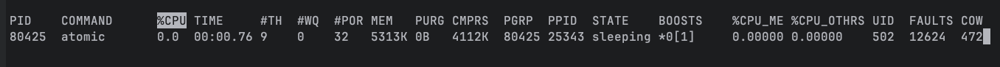
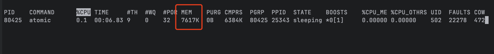
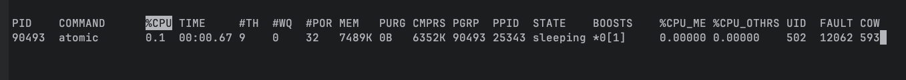
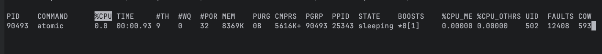
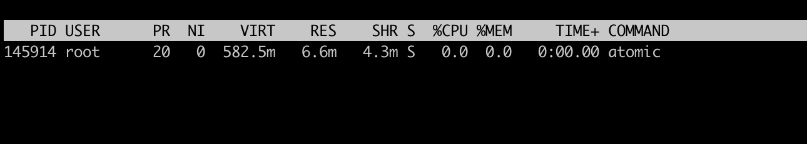
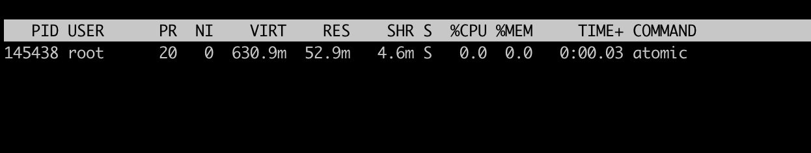
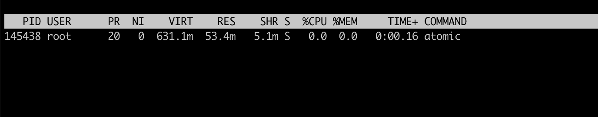

# 1、jemalloc`、`mimalloc 、glibc区别

`jemalloc`、`mimalloc` 和默认的系统堆分配器都是用于管理动态内存分配的工具。每个分配器都有其独特的设计和优化策略，适用于不同的应用场景。以下是它们的区别和各自的优点：

### jemalloc

**特点**：

- **多线程优化**：`jemalloc` 通过分配多个线程局部缓存（thread-local cache）来减少锁争用，提高多线程程序的性能。
- **内存碎片化管理**：提供更好的内存碎片化管理，适合长时间运行且频繁分配和释放内存的应用。
- **可配置性**：支持多种配置选项，可以通过环境变量进行调整，如启用 Transparent Huge Pages (THP)。
- **内存统计**：提供详细的内存使用统计信息，帮助开发者分析和优化内存使用。

**优点**：

- 在多线程应用中表现出色，减少锁争用。
- 提供详细的内存使用统计，便于调试和优化。

### mimalloc

**特点**：

- **快速分配和释放**：`mimalloc` 以其高效的分配和释放速度为特点，尤其在小对象的分配上表现优异。
- **低内存使用**：通过减少内存碎片化和提高内存利用率来降低整体内存使用。
- **轻量级**：设计简单，代码体积小，易于集成。

**优点**：

- 在小对象分配上非常高效。
- 内存使用效率高，减少内存碎片化。

### 默认系统分配器

**特点**：

- **平台依赖**：默认系统分配器随操作系统不同而不同。在 Linux 上通常是 `glibc` 的 `ptmalloc`，在 Windows 上则是 `HeapAlloc`。
- **通用性**：设计为通用分配器，适用于大多数应用程序。

**优点**：

- 与操作系统紧密集成，通常不需要额外配置。
- 对于不需要特殊优化的应用，使用系统默认分配器

`ptmalloc` 是 `glibc` 中的默认内存分配器，它是基于 Doug Lea 的 `dlmalloc` 的一个变种，并针对多线程环境进行了优化。以下是 `ptmalloc` 的一些优缺点：

优点

1. **多线程支持**：
   - `ptmalloc` 增加了对多线程环境的支持，通过使用线程局部存储和锁来管理并发访问，减少了锁争用。
2. **广泛使用**：
   - 作为 `glibc` 的默认分配器，`ptmalloc` 被广泛使用并经过了大量的测试和验证，具有较高的稳定性和可靠性。
3. **内存碎片化管理**：
   - 提供了合理的内存碎片化管理策略，能在大多数情况下有效地利用内存。
4. **与系统集成良好**：
   - 作为 `glibc` 的一部分，`ptmalloc` 与 Linux 系统有良好的集成，通常不需要额外的配置。

缺点

1. **线程争用**：
   - 尽管 `ptmalloc` 针对多线程环境进行了优化，但在高并发场景下仍可能出现锁争用，导致性能下降。
2. **内存使用效率**：
   - 在某些特定的工作负载下，`ptmalloc` 的内存使用效率可能不如专门优化的分配器（如 `jemalloc` 和 `mimalloc`）。
3. **可配置性和调试能力有限**：
   - 相比于 `jemalloc`，`ptmalloc` 提供的配置选项和调试工具较少，开发者在分析和优化内存使用时可能会受到限制。
4. **更新和优化较慢**：
   - 由于其是 `glibc` 的一部分，`ptmalloc` 的更新和优化速度可能不如独立的内存分配器项目快。

总结来说，`ptmalloc` 是一个通用且稳定的内存分配器，适合大多数应用程序。但对于需要高性能和低内存碎片化的应用，特别是在高并发环境下，可能

# 2、使用

## 原始分配器 mac


**启动时刻**



2千次请求




## jemalloc  Mac使用

[github](https://github.com/tikv/jemallocator)


```
// main.rs
#[cfg(not(target_env = "msvc"))]
use tikv_jemallocator::Jemalloc;

#[cfg(not(target_env = "msvc"))]
#[global_allocator]
static GLOBAL: Jemalloc = Jemalloc;
```


启动



80次请求后




## jemalloc linux

未使用




增加1.1m


**使用**

启动




60次请求




增加0.5m


