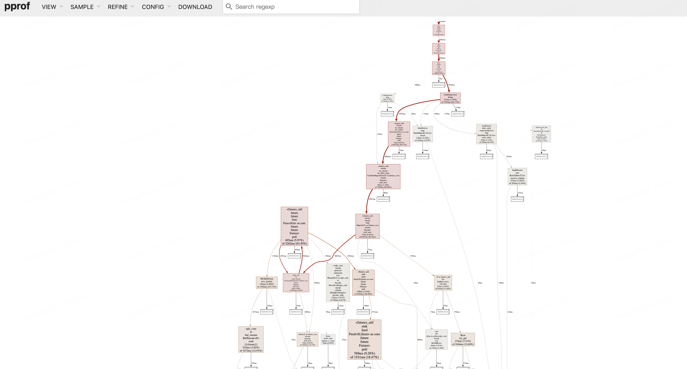
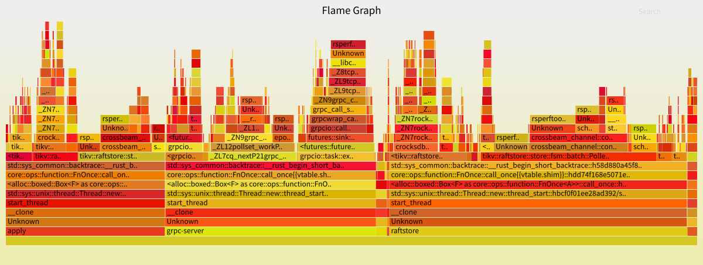

# 1 Proof 分析irust的cpu

```
https://github.com/tikv/pprof-rs/tree/master
```


**功能引入**

Cargo.toml

```
pprof = { version = "0.13.0", features = ["flamegraph","_protobuf","protobuf-codec"] }
```


**代码**

```
use actix_web::{get, HttpResponse, Responder};
use pprof;
use std::fs::File;
use  std::io::Write;
use pprof::protos::Message;

use crate::controller::xx::check::LinkInspection;
#[get("/check")]
async fn check() -> impl Responder {
    let guard = pprof::ProfilerGuardBuilder::default()
        .frequency(1000)
        .blocklist(&["libc", "libgcc", "pthread", "vdso"])
        .build().unwrap();

    let res = x x::new().doing().await;
    // match res {
    //     Ok(response) => HttpResponse::Ok().json(response),
    //     Err(error) => HttpResponse::InternalServerError().body(error.to_string()),
    // }

    match guard.report().build() {
        Ok(reports) => {
            let  mut file = File::create("profile.pb").unwrap();
            let profile = reports.pprof().unwrap();
            let res = profile.write_to_bytes().unwrap();
            file.write_all(&res).unwrap();

            println!("report: {:?}", &reports)
        }
        Err(e) => {
            println!("error {:?}",e);
        }
    }
    HttpResponse::InternalServerError().body("OK".to_string())
}

```


启动并请求程序

```
-rw-r----- 1 root root    83318 Nov 21 19:55 profile.pb
```


查看

```
$ ~/go/bin/pprof --http=localhost:8080  profile.pb
Main binary filename not available.
Serving web UI on http://localhost:8080
```




还可以有火焰图




 ## 1.2 proof 安装

```
https://github.com/google/pprof/
```


```
go install github.com/google/pprof@latest
```


